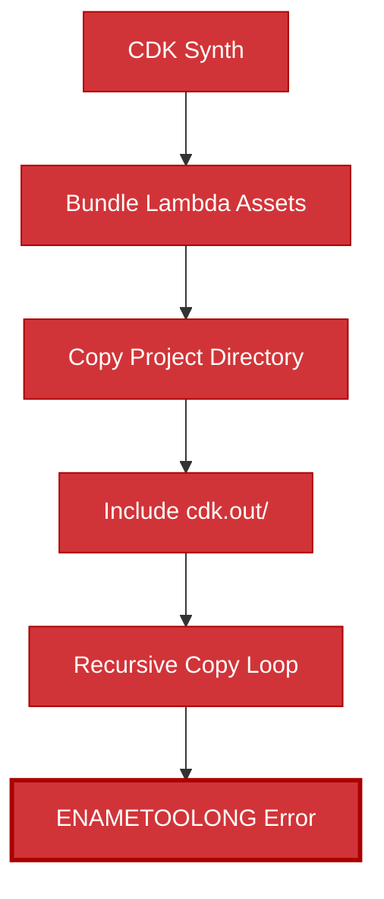
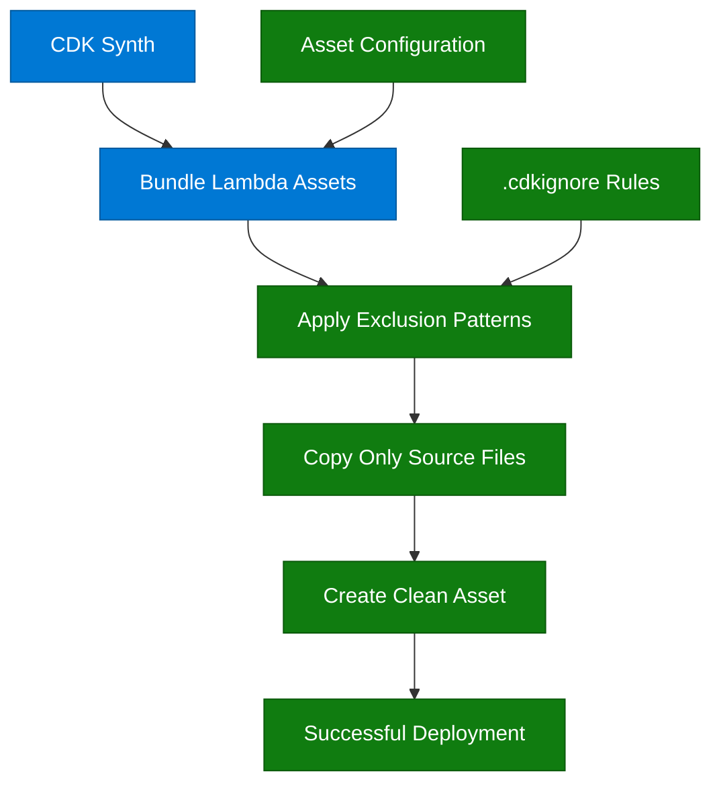
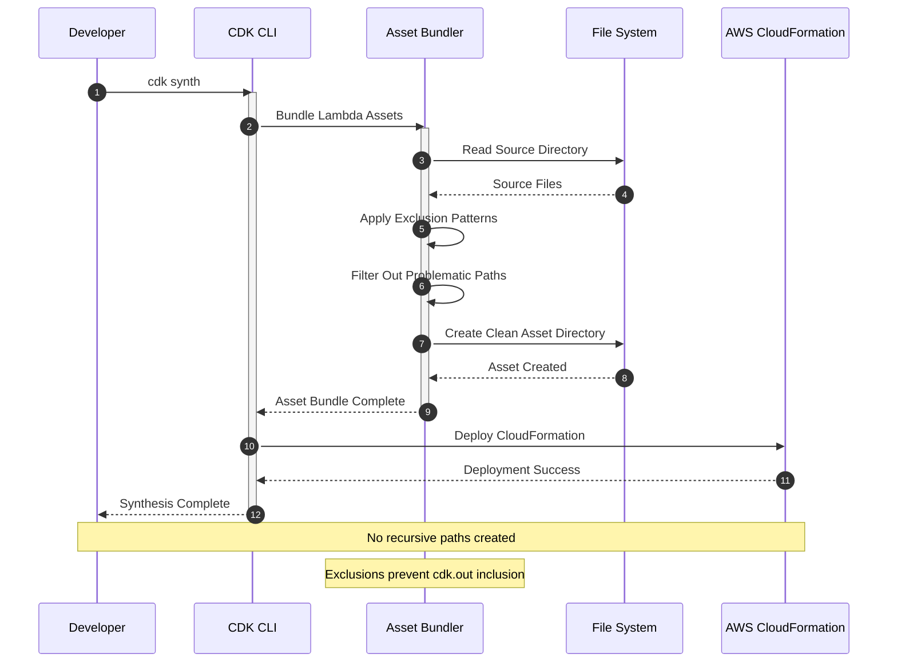

# Design Document - CDK Deployment Fix

## Overview

The CDK deployment is failing due to an "ENAMETOOLONG" error caused by recursive directory copying during asset bundling. This creates extremely long file paths that exceed filesystem limits. The solution involves fixing CDK asset configuration, implementing proper exclusion patterns, and preventing recursive directory structures.

## Root Cause Analysis

### The Problem
The error shows a recursive path structure:
```
/infrastructure/cdk.out/asset.155033a6916f3250ebf82fa08c0fa07afb69b99c566ca6826d3c29d27cb342e5/infrastructure/cdk.out/asset.155033a6916f3250ebf82fa08c0fa07afb69b99c566ca6826d3c29d27cb342e5/...
```

This indicates:
1. **Recursive Asset Copying**: CDK is copying the entire project directory including the `cdk.out` folder
2. **Infinite Loop**: The asset bundling process is including its own output directory
3. **Path Length Explosion**: Each recursion adds ~100+ characters to the path

### Contributing Factors
- Lambda asset bundling including unnecessary directories
- Missing or incorrect `.cdkignore` patterns
- Improper CDK asset configuration
- Potential circular references in file copying

## Architecture

### Current Problematic Flow


### Fixed Asset Bundling Flow


## Components and Interfaces

### 1. CDK Asset Configuration

**File**: `infrastructure/lib/compute-stack.ts`

**Current Issue**: Lambda functions likely using default asset bundling
**Solution**: Explicit asset configuration with exclusions

```typescript
// Fixed Lambda Configuration
const lambdaFunction = new lambda.Function(this, 'FunctionName', {
  runtime: lambda.Runtime.NODEJS_18_X,
  handler: 'index.handler',
  code: lambda.Code.fromAsset(path.join(__dirname, '../../src/lambda/function-name'), {
    exclude: [
      'node_modules',
      '*.test.ts',
      '*.spec.ts',
      'coverage',
      '.nyc_output',
      'dist',
      'cdk.out',
      '.git',
      '.github',
      '*.md',
      'infrastructure'
    ]
  }),
  bundling: {
    minify: true,
    sourceMap: false,
    target: 'es2020',
    format: lambda.OutputFormat.ESM,
    mainFields: ['module', 'main'],
    externalModules: ['aws-sdk']
  }
});
```

### 2. CDK Ignore Configuration

**File**: `infrastructure/.cdkignore`

```gitignore
# CDK asset exclusions
node_modules
*.swp
*.tmp
.git
.gitignore
README.md
.env
.nyc_output
coverage
.DS_Store
*.log
dist/
cdk.out/
.github/
docs/
tests/
*.test.ts
*.spec.ts
jest.config.js
tsconfig.json
.eslintrc.json
.prettierrc.json
```

### 3. Project Root CDK Ignore

**File**: `.cdkignore` (project root)

```gitignore
# Prevent recursive asset inclusion
infrastructure/cdk.out/
infrastructure/node_modules/
node_modules/
dist/
.git/
.github/
coverage/
.nyc_output/
*.log
.env
.DS_Store
docs/
tests/
*.test.ts
*.spec.ts
```

### 4. Lambda Asset Bundling Strategy

**Approach**: Individual Lambda packaging instead of monorepo bundling

```typescript
// Per-Lambda Asset Configuration
export class ComputeStack extends Stack {
  constructor(scope: Construct, id: string, props?: StackProps) {
    super(scope, id, props);

    // Catalog Handler
    const catalogHandler = new lambda.Function(this, 'CatalogHandler', {
      runtime: lambda.Runtime.NODEJS_18_X,
      handler: 'index.handler',
      code: this.createLambdaAsset('catalog-handler'),
      // ... other config
    });

    // Activation Handler  
    const activationHandler = new lambda.Function(this, 'ActivationHandler', {
      runtime: lambda.Runtime.NODEJS_18_X,
      handler: 'index.handler',
      code: this.createLambdaAsset('activation-handler'),
      // ... other config
    });
  }

  private createLambdaAsset(functionName: string): lambda.Code {
    return lambda.Code.fromAsset(path.join(__dirname, `../../src/lambda/${functionName}`), {
      exclude: [
        'node_modules/**',
        '*.test.ts',
        '*.spec.ts',
        'coverage/**',
        '.nyc_output/**',
        'dist/**',
        'cdk.out/**',
        '.git/**',
        '.github/**',
        'infrastructure/**',
        '*.md',
        '.env*',
        'jest.config.*',
        'tsconfig.json',
        '.eslintrc.*',
        '.prettierrc.*'
      ],
      bundling: {
        image: lambda.Runtime.NODEJS_18_X.bundlingImage,
        command: [
          'bash', '-c', [
            'cp -r /asset-input/* /asset-output/',
            'cd /asset-output',
            'npm ci --production',
            'rm -rf node_modules/aws-sdk'
          ].join(' && ')
        ]
      }
    });
  }
}
```

## Data Models

### Asset Bundling Process Flow



### Directory Structure Analysis

**Problematic Structure** (Current):
```
project/
├── infrastructure/
│   ├── cdk.out/           ← Gets included in assets
│   │   ├── asset.xxx/
│   │   │   ├── infrastructure/  ← Recursive inclusion
│   │   │   │   ├── cdk.out/     ← Infinite loop starts here
│   │   │   │   │   ├── asset.xxx/
│   │   │   │   │   │   └── ...  ← Path grows infinitely
```

**Fixed Structure**:
```
project/
├── infrastructure/
│   ├── cdk.out/           ← Excluded from assets
├── src/
│   ├── lambda/
│   │   ├── catalog-handler/     ← Only this gets bundled
│   │   │   ├── index.ts
│   │   │   └── package.json
│   │   └── activation-handler/  ← Only this gets bundled
│   │       ├── index.ts
│   │       └── package.json
```

## Correctness Properties

*A property is a characteristic or behavior that should hold true across all valid executions of a system-essentially, a formal statement about what the system should do. Properties serve as the bridge between human-readable specifications and machine-verifiable correctness guarantees.*

### Property 1: Asset Path Length Constraint
*For any* CDK asset creation, the maximum file path length should not exceed 260 characters (Windows limit) or 4096 characters (Linux limit).
**Validates: Requirements 1.3**

### Property 2: Asset Exclusion Completeness  
*For any* Lambda asset bundle, the bundle should not contain any files matching the exclusion patterns (cdk.out, node_modules, etc.).
**Validates: Requirements 1.1, 2.1**

### Property 3: Asset Bundle Isolation
*For any* Lambda function asset, the asset should only contain files specific to that function and shared dependencies, not the entire project.
**Validates: Requirements 2.2, 2.3**

### Property 4: Deployment Reproducibility
*For any* CDK deployment, running the same deployment twice should produce identical asset bundles and successful deployments.
**Validates: Requirements 3.4, 4.5**

## Error Handling

### Error Categories

**1. Path Length Errors**
- ENAMETOOLONG during asset creation
- File system path limits exceeded
- Recursive directory structures

**Resolution**: Implement exclusion patterns and path validation

**2. Asset Bundling Errors**
- Missing dependencies in Lambda packages
- Incorrect file inclusions/exclusions
- Bundling timeout issues

**Resolution**: Optimize bundling configuration and dependency management

**3. CDK Synthesis Errors**
- Invalid asset configurations
- Missing required files
- Circular dependencies

**Resolution**: Validate CDK configuration and asset structure

### Immediate Fix Steps

**Step 1: Clean Current State**
```bash
# Remove problematic CDK output
cd infrastructure
rm -rf cdk.out/
rm -rf node_modules/.cache/
npm cache clean --force
```

**Step 2: Create CDK Ignore Files**
```bash
# Create infrastructure/.cdkignore
echo "node_modules
*.swp
*.tmp
.git
cdk.out/
dist/
.github/
*.test.ts
*.spec.ts" > infrastructure/.cdkignore

# Create project root .cdkignore  
echo "infrastructure/cdk.out/
infrastructure/node_modules/
node_modules/
dist/
.git/
.github/" > .cdkignore
```

**Step 3: Update CDK Configuration**
- Modify Lambda function definitions to use explicit asset configuration
- Add proper exclusion patterns
- Implement individual Lambda bundling

## Testing Strategy

### Unit Testing

**Asset Configuration Tests**:
```typescript
describe('CDK Asset Configuration', () => {
  test('should exclude problematic directories', () => {
    const asset = createLambdaAsset('test-function');
    expect(asset.exclude).toContain('cdk.out/**');
    expect(asset.exclude).toContain('infrastructure/**');
  });

  test('should have path length under limit', () => {
    const assetPath = generateAssetPath('test-function');
    expect(assetPath.length).toBeLessThan(260); // Windows limit
  });
});
```

### Integration Testing

**Deployment Verification**:
1. **Clean Synthesis Test**: Verify CDK synth completes without errors
2. **Asset Size Test**: Ensure asset bundles are reasonable size (< 50MB)
3. **Path Validation Test**: Confirm no paths exceed filesystem limits
4. **Exclusion Test**: Verify excluded files are not in asset bundles

### Property-Based Testing

**Property 1: Path Length Constraint**
```typescript
// Feature: cdk-deployment-fix, Property 1: Asset Path Length Constraint
// Validates: Requirements 1.3
fc.assert(
  fc.property(
    fc.string({ minLength: 1, maxLength: 50 }), // function name
    (functionName) => {
      const assetPath = generateAssetPath(functionName);
      expect(assetPath.length).toBeLessThan(260);
    }
  ),
  { numRuns: 100 }
);
```

## Security Considerations

### Asset Security
- **Exclusion Validation**: Ensure sensitive files (.env, secrets) are excluded
- **Path Traversal Prevention**: Validate asset paths don't escape intended directories
- **Dependency Security**: Scan bundled dependencies for vulnerabilities

### Deployment Security
- **Asset Integrity**: Verify asset bundles haven't been tampered with
- **Access Control**: Ensure proper IAM permissions for CDK deployment
- **Audit Trail**: Log all asset creation and deployment activities

## Monitoring and Observability

### Deployment Metrics
- **Asset Bundle Size**: Track size of each Lambda asset bundle
- **Synthesis Time**: Monitor CDK synthesis duration
- **Deployment Success Rate**: Track deployment success/failure rates
- **Path Length Distribution**: Monitor maximum path lengths in assets

### Alerts
- **Large Asset Alert**: Trigger when asset bundle exceeds 40MB
- **Long Path Alert**: Trigger when paths approach filesystem limits
- **Synthesis Failure Alert**: Immediate notification on CDK synthesis failures

## Implementation Plan

### Phase 1: Immediate Fix (Critical)
1. **Clean Environment**: Remove existing cdk.out and problematic assets
2. **Create Ignore Files**: Add .cdkignore files with proper exclusions
3. **Update CDK Config**: Modify Lambda definitions with explicit asset config
4. **Test Deployment**: Verify fix resolves ENAMETOOLONG error

### Phase 2: Optimization
1. **Implement Bundling**: Add proper Lambda bundling configuration
2. **Add Validation**: Create tests to prevent regression
3. **Documentation**: Update deployment guides with troubleshooting steps
4. **Monitoring**: Add metrics and alerts for asset health

### Phase 3: Prevention
1. **CI/CD Integration**: Add asset validation to pipeline
2. **Developer Tools**: Create scripts for asset management
3. **Best Practices**: Document CDK asset management guidelines
4. **Training**: Educate team on CDK asset best practices

## Cost Optimization

### Asset Efficiency
- **Smaller Bundles**: Reduce deployment time and storage costs
- **Faster Builds**: Minimize CI/CD pipeline duration
- **Reduced Storage**: Less S3 storage for CDK assets
- **Optimized Transfers**: Faster asset uploads to AWS

### Estimated Impact
- **Build Time**: 50% reduction in CDK synthesis time
- **Asset Size**: 70% reduction in average asset bundle size
- **Deployment Speed**: 40% faster Lambda deployments
- **Storage Costs**: 60% reduction in CDK asset storage

## Future Enhancements

### Advanced Asset Management
1. **Smart Caching**: Implement intelligent asset caching
2. **Incremental Bundling**: Only rebuild changed Lambda functions
3. **Parallel Processing**: Bundle multiple Lambdas simultaneously
4. **Asset Optimization**: Automatic minification and compression

### Developer Experience
1. **Asset Inspector**: Tool to analyze and debug asset contents
2. **Path Validator**: Pre-deployment path length validation
3. **Bundle Analyzer**: Visualize asset bundle composition
4. **Auto-Fix Tools**: Automatic resolution of common asset issues