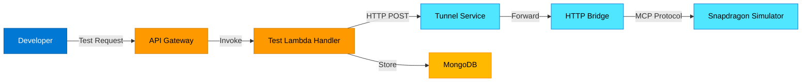
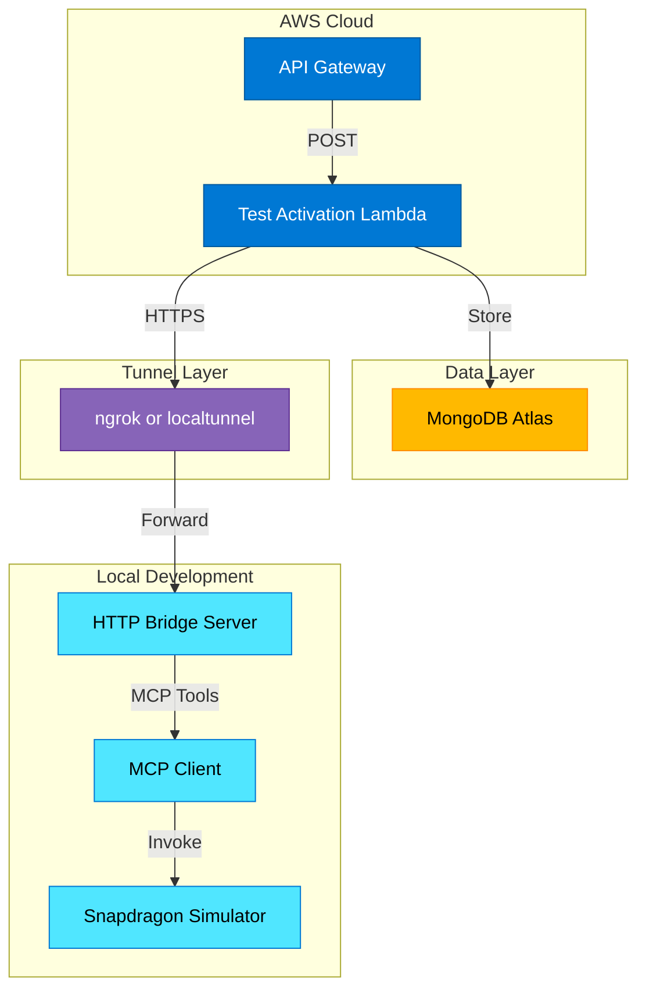
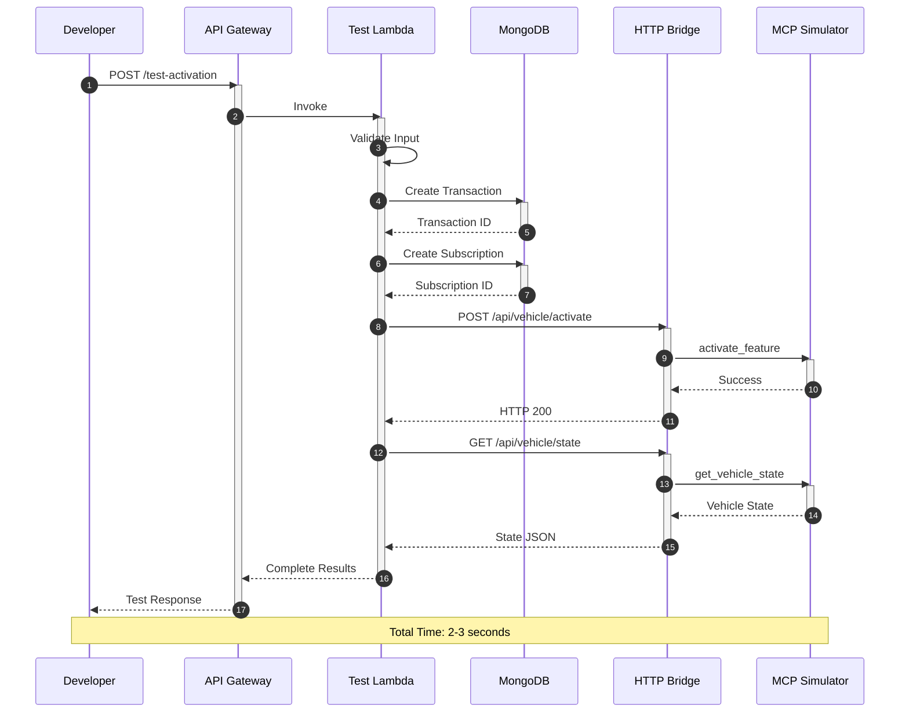

# Design Document: MCP Test Integration System

## Overview

The MCP Test Integration System provides a simplified testing infrastructure for the Feature on Demand (FOD) platform by enabling direct communication between AWS Lambda functions and the Snapdragon Digital Chassis simulator. The system consists of three main components: an HTTP Bridge that wraps the MCP simulator, a Test Activation Lambda handler that orchestrates the activation flow, and API Gateway endpoints that expose testing capabilities.

The HTTP Bridge serves as a translation layer between AWS Lambda's HTTP-based communication and the MCP protocol. It exposes REST API endpoints that Lambda functions can call to interact with the simulator. The bridge runs locally during development and can be exposed to AWS Lambda via tunnel services like ngrok or localtunnel.

The Test Activation Handler implements the complete purchase-to-activation flow in a single Lambda function, creating transaction records, managing subscriptions, invoking the simulator via the HTTP Bridge, and returning comprehensive test results.

## Architecture

### High-Level System Architecture




### Component Architecture




### Detailed Activation Flow Sequence




## Components and Interfaces

### 1. HTTP Bridge Server

The HTTP Bridge is an Express.js server that wraps the MCP simulator and exposes it as a REST API.

**Technology Stack:**
- Node.js 18.x
- Express.js 4.x
- @modelcontextprotocol/sdk
- CORS middleware

**API Endpoints:**

```typescript
// Activate a feature
POST /api/vehicle/:vehicleId/activate
Body: { featureId: string, duration?: number }
Response: { success: boolean, data: ActivationResult }

// Deactivate a feature
POST /api/vehicle/:vehicleId/deactivate
Body: { featureId: string }
Response: { success: boolean, data: DeactivationResult }

// Get vehicle state
GET /api/vehicle/:vehicleId/state
Response: { success: boolean, data: VehicleState }

// Advance time for testing
POST /api/vehicle/:vehicleId/advance-time
Body: { hours: number }
Response: { success: boolean }

// Reset vehicle
POST /api/vehicle/:vehicleId/reset
Response: { success: boolean }

// Health check
GET /health
Response: { status: string, mcpConnected: boolean }
```

**Configuration:**

```typescript
interface BridgeConfig {
  port: number;                    // Default: 3001
  mcpServerPath: string;           // Path to MCP server
  corsOrigins: string[];           // Allowed origins
  apiKey?: string;                 // Optional auth
  timeout: number;                 // Request timeout ms
  logLevel: 'debug' | 'info' | 'warn' | 'error';
}
```

### 2. Test Activation Lambda Handler

The Lambda function orchestrates the complete activation flow.

**Handler Interface:**

```typescript
interface TestActivationRequest {
  vehicleId: string;
  featureId: string;
  userId: string;
  duration?: number;        // hours
  isPermanent?: boolean;
}

interface TestActivationResponse {
  success: boolean;
  data: {
    transaction: TransactionDetails;
    subscription: SubscriptionDetails;
    activation: ActivationDetails;
    vehicleState: VehicleStateDetails;
    timing: TimingMetrics;
  };
  error?: ErrorDetails;
}
```

**Environment Variables:**

```typescript
MONGODB_URI: string;              // MongoDB connection
HTTP_BRIDGE_URL: string;          // Bridge URL via tunnel
HTTP_BRIDGE_API_KEY?: string;     // Optional API key
HTTP_BRIDGE_TIMEOUT: string;      // Timeout ms
LOG_LEVEL: string;                // Logging level
```

### 3. Tunnel Service Integration

**Supported Services:**
- ngrok (commercial with free tier)
- localtunnel (open-source)
- AWS deployment (Lambda/ECS for production)

**ngrok Setup:**

```bash
# Start tunnel
ngrok http 3001

# Output provides public URL
Forwarding: https://abc123.ngrok.io -> http://localhost:3001

# Set in Lambda environment
HTTP_BRIDGE_URL=https://abc123.ngrok.io
```


## Data Models

### Transaction Model (MongoDB)

```typescript
interface Transaction {
  transactionId: string;        // UUID
  userId: string;
  vehicleId: string;
  featureId: string;
  amount: number;
  currency: string;             // Default: 'USD'
  status: 'PENDING' | 'COMPLETED' | 'FAILED';
  createdAt: Date;
  completedAt?: Date;
  metadata: {
    testMode: boolean;          // Always true
    source: string;             // 'TEST_ENDPOINT'
  };
}
```

### Subscription Model (MongoDB)

```typescript
interface Subscription {
  subscriptionId: string;       // UUID
  userId: string;
  vehicleId: string;
  featureId: string;
  status: 'ACTIVE' | 'EXPIRED' | 'CANCELLED';
  activatedAt: Date;
  expiresAt?: Date;             // null for permanent
  isPermanent: boolean;
  metadata: {
    testMode: boolean;
    transactionId: string;
  };
}
```


## Correctness Properties

*A property is a characteristic or behavior that should hold true across all valid executions of a system-essentially, a formal statement about what the system should do. Properties serve as the bridge between human-readable specifications and machine-verifiable correctness guarantees.*

### Property 1: HTTP Bridge Communication

*For any* valid test activation request, the Test Activation Handler should make HTTP POST requests to the bridge with correct endpoint paths and request payloads containing vehicleId and featureId.

**Validates: Requirements 1.2**

### Property 2: Complete Response Structure

*For any* successful activation, the response should contain all required fields: transaction details (transactionId, amount, timestamp), subscription details (subscriptionId, featureId, expiresAt), activation details (vehicleId, status, activatedAt), and vehicleState (activeFeatures, connectivityTier, performanceMode).

**Validates: Requirements 1.3, 2.5, 6.4, 7.1, 7.2, 7.3, 7.4**


### Property 3: Input Validation

*For any* request with invalid parameters (missing vehicleId, empty featureId, negative duration), the system should reject the request before processing and return an error response indicating which validation rule was violated.

**Validates: Requirements 1.4, 4.4**

### Property 4: Transaction Creation

*For any* test activation request, a transaction record should be created in MongoDB with status COMPLETED, testMode true, and matching vehicleId and featureId from the request.

**Validates: Requirements 2.1**

### Property 5: Subscription Creation with Expiration

*For any* transaction with a duration parameter, a subscription record should be created with expiresAt timestamp equal to activatedAt plus the duration in hours.

**Validates: Requirements 2.2, 3.3, 6.3**


### Property 6: Simulator Activation Invocation

*For any* subscription created, the system should invoke the MCP simulator activate_feature function via the HTTP bridge before returning the response.

**Validates: Requirements 2.3**

### Property 7: Activation Timestamp Recording

*For any* successful simulator activation, the subscription record should have an activatedAt timestamp and status set to ACTIVE.

**Validates: Requirements 2.4**

### Property 8: Feature Type Support

*For any* feature type (connectivity tiers 4G/5G, performance modes SPORT/ECO/COMFORT), the system should successfully process the activation request and create appropriate records.

**Validates: Requirements 3.1, 3.2**


### Property 9: Permanent Feature Handling

*For any* activation request with isPermanent set to true, the subscription should be created with expiresAt as null and isPermanent as true.

**Validates: Requirements 3.4**

### Property 10: Vehicle State Verification

*For any* activated feature, querying the vehicle state via the HTTP bridge should return the featureId in the activeFeatures array.

**Validates: Requirements 6.1, 6.2**

### Property 11: Bridge REST to MCP Translation

*For any* HTTP request to the bridge endpoints, the bridge should invoke the corresponding MCP tool (activate_feature for POST /activate, get_vehicle_state for GET /state, etc.) and return JSON responses with appropriate HTTP status codes.

**Validates: Requirements 8.2, 8.3, 8.4**


## Error Handling

### Lambda Handler Error Scenarios

**Input Validation Errors (HTTP 400)**
- Missing required fields (vehicleId, featureId, userId)
- Invalid feature types or configurations
- Negative duration values
- Response includes specific validation error message

**Database Errors (HTTP 500)**
- MongoDB connection failures
- Transaction creation failures
- Subscription creation failures
- Response includes error code and operation that failed

**HTTP Bridge Communication Errors**
- Connection timeout (HTTP 504): Bridge unreachable
- Service unavailable (HTTP 503): Bridge not responding
- Internal errors (HTTP 500): MCP operation failures
- Response includes retry guidance and bridge status


### HTTP Bridge Error Scenarios

**MCP Tool Invocation Errors (HTTP 500)**
- MCP server not connected
- Tool execution failures
- Invalid tool parameters
- Response includes MCP error details

**Request Validation Errors (HTTP 400)**
- Invalid vehicle ID format
- Missing required request body fields
- Invalid JSON payload
- Response includes validation error message

**Timeout Errors (HTTP 504)**
- MCP operation exceeds timeout (default 30s)
- Response includes timeout duration

**Authentication Errors (HTTP 401)**
- Missing or invalid API key (if enabled)
- Response includes authentication requirement


## Testing Strategy

### Unit Testing

**Test Activation Lambda Handler:**
- Input validation logic
- Database operation mocking
- HTTP client request formatting
- Response building logic
- Error handling for each failure scenario

**HTTP Bridge Server:**
- Endpoint routing
- Request body parsing
- MCP client initialization
- Tool invocation logic
- Error response formatting

**Test Framework:** Jest with ts-jest
**Coverage Target:** 80% code coverage minimum


### Property-Based Testing

**Testing Library:** fast-check for TypeScript
**Minimum Iterations:** 100 runs per property

**Property Test Coverage:**
- Property 1: HTTP bridge communication with random valid requests
- Property 2: Response structure completeness with various feature types
- Property 3: Input validation with random invalid inputs
- Property 4: Transaction creation with random vehicle/feature IDs
- Property 5: Expiration calculation with random duration values
- Property 6: Simulator invocation verification
- Property 7: Timestamp recording accuracy
- Property 8: Feature type support across all valid types
- Property 9: Permanent feature handling
- Property 10: Vehicle state verification
- Property 11: Bridge translation layer correctness

Each property test must include a comment referencing the design document property number.


### Integration Testing

**End-to-End Flow Tests:**
1. Start HTTP Bridge locally
2. Start ngrok tunnel
3. Deploy Lambda with bridge URL
4. Invoke test endpoint via API Gateway
5. Verify complete flow execution
6. Check database records
7. Verify simulator state

**Test Scenarios:**
- Connectivity upgrade (4G to 5G)
- Performance mode activation (SPORT mode for 48 hours)
- Permanent feature activation
- Multiple features on same vehicle
- Feature expiration handling
- Error scenarios (bridge down, invalid inputs)


## Security Considerations

### Authentication and Authorization

**HTTP Bridge:**
- Optional API key authentication via header
- CORS configuration for allowed origins
- Rate limiting to prevent abuse
- Request logging for audit trail

**Lambda Function:**
- IAM role with minimal permissions
- Environment variable encryption for sensitive data
- VPC deployment for database access
- API Gateway authentication (IAM or Cognito)

### Data Protection

**In Transit:**
- HTTPS for all communications
- TLS 1.3 for tunnel services
- Encrypted MongoDB connections

**At Rest:**
- MongoDB encryption enabled
- Lambda environment variables encrypted with KMS
- CloudWatch Logs encryption


### Secrets Management

**Bridge Configuration:**
- API keys stored in environment variables
- MCP server path configurable
- No hardcoded credentials

**Lambda Configuration:**
- MongoDB URI from AWS Secrets Manager
- Bridge URL from environment variable
- Bridge API key from Secrets Manager (if used)

## Monitoring

### CloudWatch Metrics

**Lambda Metrics:**
- Invocation count
- Error rate
- Duration (p50, p95, p99)
- Concurrent executions
- Throttles

**Custom Metrics:**
- Test activation success rate
- Bridge communication latency
- Database operation duration
- End-to-end flow duration


### CloudWatch Alarms

**Critical Alarms:**
- Lambda error rate > 5% (5 minutes)
- Bridge communication failures > 10% (5 minutes)
- Database connection failures (any occurrence)
- Lambda duration > 25 seconds (approaching timeout)

**Warning Alarms:**
- Test activation latency > 3 seconds (10 minutes)
- Bridge response time > 1 second (10 minutes)

### Logging Strategy

**Lambda Logs:**
- Structured JSON logging
- Request correlation IDs
- Timing for each step
- Error context with stack traces
- Log level: INFO for production, DEBUG for development

**Bridge Logs:**
- HTTP request/response logging
- MCP tool invocation details
- Error details with context
- Performance metrics


## Deployment

### HTTP Bridge Deployment

**Local Development:**
```bash
# Install dependencies
cd mcp-servers/http-bridge
npm install

# Start bridge
npm start

# Start tunnel
ngrok http 3001
```

**Configuration File:**
```json
{
  "port": 3001,
  "mcpServerPath": "../snapdragon-simulator",
  "corsOrigins": ["*"],
  "timeout": 30000,
  "logLevel": "info"
}
```

### Lambda Deployment

**CDK Stack Configuration:**
- Runtime: Node.js 18.x
- Memory: 512 MB
- Timeout: 30 seconds
- Environment variables from Secrets Manager
- VPC configuration for MongoDB access
- API Gateway integration with CORS


**Deployment Steps:**
1. Build Lambda function: `npm run build`
2. Start HTTP Bridge locally
3. Start ngrok tunnel and note public URL
4. Update Lambda environment variable: `HTTP_BRIDGE_URL`
5. Deploy CDK stack: `cdk deploy ComputeStack`
6. Test endpoint via API Gateway URL

### CI/CD Pipeline

**Build Stage:**
- Install dependencies
- Run TypeScript compilation
- Run linter (ESLint)
- Run unit tests
- Generate coverage report

**Test Stage:**
- Start local bridge and simulator
- Run integration tests
- Run property-based tests
- Verify test coverage > 80%

**Deploy Stage:**
- Package Lambda function
- Update CDK stack
- Run smoke tests
- Monitor CloudWatch metrics

