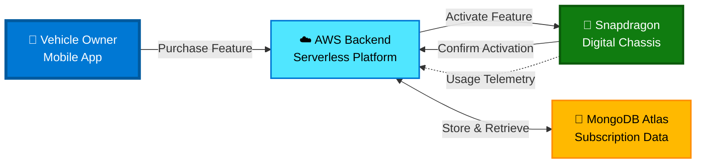
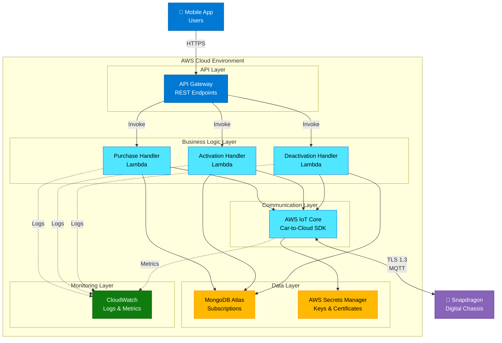
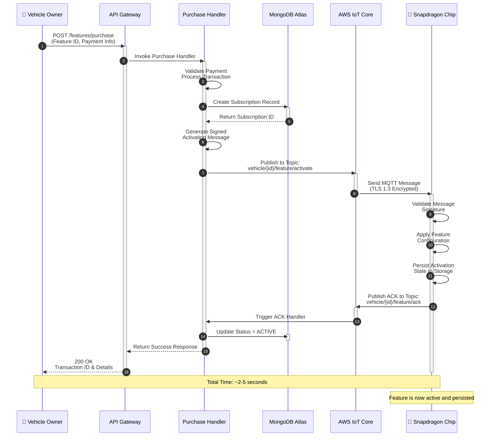
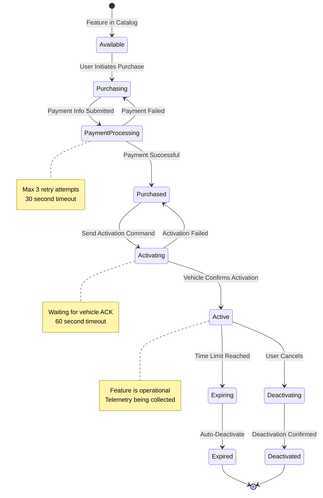
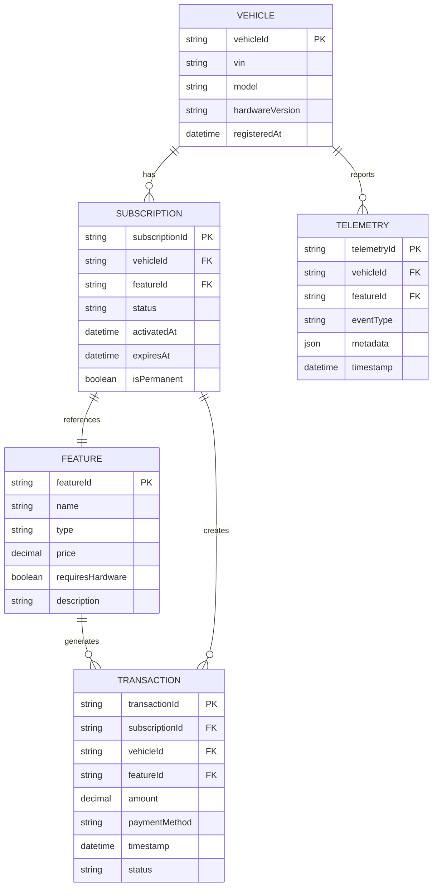
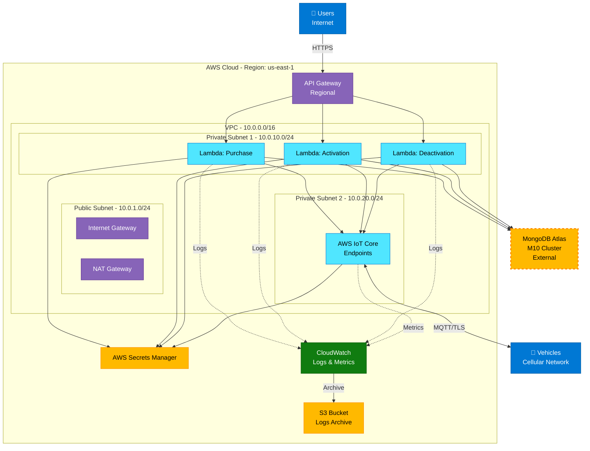

# Design Document - Snapdragon FOD AWS System

## Overview

The Snapdragon Feature on Demand (FOD) system enables dynamic activation of vehicle features through AWS cloud integration with Qualcomm Snapdragon Digital Chassis. The system supports two primary use cases:

1. **Connectivity Tier Upgrades**: Soft-SKU upgrades from 4G to 5G connectivity
2. **Temporary Performance Features**: Time-limited activations like sport mode for weekend rentals

The architecture leverages AWS serverless services for transaction processing and uses Qualcomm's Car-to-Cloud SDK for secure vehicle communication.

## Architecture

### High-Level Architecture



### Component Architecture



## Components and Interfaces

### 1. API Gateway

**Purpose**: RESTful API endpoint for mobile applications

**Endpoints**:
- `POST /features/purchase` - Purchase a feature
- `POST /features/activate` - Activate a purchased feature
- `GET /features/catalog` - List available features
- `GET /vehicles/{vehicleId}/features` - Get active features
- `DELETE /features/{featureId}` - Deactivate a feature

**Authentication**: AWS Cognito JWT tokens

**Rate Limiting**: 
- Burst: 100 requests
- Steady: 50 requests/second per user

### 2. Lambda Functions

#### Purchase Handler
**Trigger**: API Gateway POST /features/purchase
**Runtime**: Node.js 18.x
**Memory**: 512MB
**Timeout**: 30 seconds

**Input**:
```typescript
interface PurchaseRequest {
  vehicleId: string;
  featureId: string;
  duration?: number; // hours, for time-limited features
  paymentMethod: string;
}
```

**Output**:
```typescript
interface PurchaseResponse {
  success: boolean;
  transactionId: string;
  featureId: string;
  expiresAt?: string;
}
```

#### Activation Handler
**Trigger**: API Gateway POST /features/activate
**Runtime**: Node.js 18.x
**Memory**: 512MB
**Timeout**: 30 seconds

**Responsibilities**:
1. Validate purchase/subscription
2. Generate activation message
3. Sign message with private key
4. Publish to AWS IoT Core
5. Update MongoDB subscription status

#### Deactivation Handler
**Trigger**: 
- API Gateway DELETE request
- CloudWatch Events (scheduled expiration check)

**Responsibilities**:
1. Send deactivation message via IoT Core
2. Update subscription status
3. Log deactivation event

### 3. AWS IoT Core

**Purpose**: Secure, bidirectional communication with vehicles

**Topics Structure**:
- `vehicle/{vehicleId}/feature/activate` - Activation commands
- `vehicle/{vehicleId}/feature/deactivate` - Deactivation commands
- `vehicle/{vehicleId}/feature/ack` - Acknowledgments from vehicle
- `vehicle/{vehicleId}/telemetry` - Usage telemetry from vehicle

**Security**:
- X.509 certificates for device authentication
- IoT policies with least-privilege access
- TLS 1.3 for all connections

### 4. MongoDB Atlas

**Purpose**: Store subscription and activation data

**Collections**:

**features**:
```typescript
{
  _id: ObjectId,
  featureId: string,
  name: string,
  type: 'CONNECTIVITY_TIER' | 'PERFORMANCE_MODE',
  pricing: {
    oneTime?: number,
    subscription?: number,
    trial?: number
  },
  requiresHardware: boolean
}
```

**subscriptions**:
```typescript
{
  _id: ObjectId,
  vehicleId: string,
  featureId: string,
  status: 'ACTIVE' | 'EXPIRED' | 'CANCELLED',
  activatedAt: Date,
  expiresAt?: Date,
  isPermanent: boolean
}
```

**transactions**:
```typescript
{
  _id: ObjectId,
  transactionId: string,
  vehicleId: string,
  featureId: string,
  amount: number,
  timestamp: Date,
  paymentMethod: string
}
```

### 5. Snapdragon Digital Chassis Integration

**Car-to-Cloud SDK Interface**:

```typescript
interface CarToCloudClient {
  connect(config: ConnectionConfig): Promise<void>;
  subscribe(topic: string, handler: MessageHandler): void;
  publish(topic: string, message: Message): Promise<void>;
  disconnect(): Promise<void>;
}

interface FeatureActivationMessage {
  messageId: string;
  timestamp: string;
  vehicleId: string;
  messageType: 'FEATURE_ACTIVATION';
  payload: {
    featureId: string;
    featureType: 'CONNECTIVITY_TIER' | 'PERFORMANCE_MODE';
    activationConfig: {
      tier?: '4G' | '5G';
      mode?: 'SPORT' | 'ECO' | 'COMFORT';
      parameters?: Record<string, any>;
    };
    expiresAt?: string;
    isPermanent: boolean;
  };
  signature: string;
}
```

## Data Models

### Feature Activation Flow



### Feature Lifecycle State Diagram



### Data Model - Entity Relationships



### Message Signing

**Algorithm**: ECDSA with SHA-256
**Key Storage**: AWS Secrets Manager
**Key Rotation**: Every 90 days

```typescript
function signMessage(message: object, privateKey: string): string {
  const payload = JSON.stringify(message);
  const signature = crypto
    .createSign('SHA256')
    .update(payload)
    .sign(privateKey, 'base64');
  return signature;
}
```

## Correctness Properties

*A property is a characteristic or behavior that should hold true across all valid executions of a system-essentially, a formal statement about what the system should do. Properties serve as the bridge between human-readable specifications and machine-verifiable correctness guarantees.*

### Property 1: Purchase Transaction Validity
*For any* purchase request with valid payment, the AWS Backend should create exactly one subscription record and return a unique transaction ID.
**Validates: Requirements 1.1**

### Property 2: Activation Message Integrity
*For any* completed purchase, the activation message sent to the Snapdragon Chip should include all required fields (Vehicle Identity, feature identifier, activation timestamp, and expiration timestamp if applicable).
**Validates: Requirements 1.7**

### Property 3: Time-Limited Feature Expiration
*For any* time-limited feature activation, when the expiration time is reached, the Snapdragon Chip should automatically deactivate the feature and restore the previous configuration.
**Validates: Requirements 1.5**

### Property 4: State Persistence
*For any* soft-SKU upgrade activation, the Snapdragon Chip should persist the activation state such that it survives system restarts.
**Validates: Requirements 1.6**

### Property 5: Activation Instruction Completeness
*For any* activation sent by AWS Backend, the message should be successfully received and processed by the Snapdragon Chip within 60 seconds.
**Validates: Requirements 1.3, 1.4**

### Property 6: Simulator API Compatibility
*For any* activation message, both the real Snapdragon hardware and the simulator should process it using identical API interfaces.
**Validates: Requirements 2.5**

### Property 7: Simulator State Consistency
*For any* sequence of activations and deactivations in the simulator, the simulated vehicle state should accurately reflect all changes.
**Validates: Requirements 2.2, 2.3**

### Property 8: Accelerated Time Accuracy
*For any* time-limited feature in the simulator, advancing simulated time past the expiration should trigger automatic deactivation.
**Validates: Requirements 2.4**

## Error Handling

### Error Categories

**1. Payment Errors**
- Insufficient funds
- Invalid payment method
- Payment gateway timeout

**Response**: Return 402 Payment Required with error details

**2. Validation Errors**
- Invalid vehicle ID
- Feature not available for vehicle
- Missing required fields

**Response**: Return 400 Bad Request with validation errors

**3. Communication Errors**
- IoT Core connection failure
- Message delivery timeout
- Vehicle offline

**Response**: Return 503 Service Unavailable, queue message for retry

**4. Authorization Errors**
- Invalid JWT token
- Expired subscription
- Insufficient permissions

**Response**: Return 401 Unauthorized or 403 Forbidden

### Retry Strategy

**Exponential Backoff**:
```typescript
const retryDelays = [1000, 2000, 4000, 8000, 16000]; // milliseconds

async function retryWithBackoff<T>(
  operation: () => Promise<T>,
  maxRetries: number = 5
): Promise<T> {
  for (let i = 0; i < maxRetries; i++) {
    try {
      return await operation();
    } catch (error) {
      if (i === maxRetries - 1) throw error;
      await sleep(retryDelays[i]);
    }
  }
  throw new Error('Max retries exceeded');
}
```

### Dead Letter Queue

Failed activation messages are sent to SQS DLQ for manual review:
- Retention: 14 days
- Alarm: CloudWatch alarm when queue depth > 10
- Processing: Manual review and reprocessing

## Testing Strategy

### Unit Testing

**Framework**: Jest for Node.js Lambda functions

**Coverage Requirements**:
- Minimum 80% code coverage
- 100% coverage for critical paths (payment, activation)

**Test Categories**:
1. **Input Validation Tests**
   - Valid inputs produce expected outputs
   - Invalid inputs throw appropriate errors
   - Edge cases (empty strings, null values)

2. **Business Logic Tests**
   - Purchase flow creates subscription
   - Activation generates correct message format
   - Expiration triggers deactivation

3. **Integration Tests**
   - Lambda → IoT Core communication
   - Lambda → MongoDB operations
   - End-to-end activation flow

### Property-Based Testing

**Framework**: fast-check for TypeScript

**Configuration**: Minimum 100 iterations per property

**Properties to Test**:

1. **Property 1: Purchase Transaction Validity**
```typescript
// Feature: snapdragon-fod-aws, Property 1: Purchase Transaction Validity
// Validates: Requirements 1.1
fc.assert(
  fc.asyncProperty(
    fc.record({
      vehicleId: fc.string(),
      featureId: fc.constantFrom('CONNECTIVITY_5G', 'SPORT_MODE'),
      paymentMethod: fc.string()
    }),
    async (request) => {
      const response = await purchaseFeature(request);
      expect(response.success).toBe(true);
      expect(response.transactionId).toBeDefined();
      
      const subscription = await getSubscription(request.vehicleId, request.featureId);
      expect(subscription).toBeDefined();
    }
  ),
  { numRuns: 100 }
);
```

2. **Property 2: Activation Message Integrity**
```typescript
// Feature: snapdragon-fod-aws, Property 2: Activation Message Integrity
// Validates: Requirements 1.7
fc.assert(
  fc.asyncProperty(
    fc.record({
      vehicleId: fc.string(),
      featureId: fc.string(),
      expiresAt: fc.option(fc.date())
    }),
    async (data) => {
      const message = await generateActivationMessage(data);
      
      expect(message.vehicleId).toBe(data.vehicleId);
      expect(message.payload.featureId).toBe(data.featureId);
      expect(message.timestamp).toBeDefined();
      if (data.expiresAt) {
        expect(message.payload.expiresAt).toBeDefined();
      }
    }
  ),
  { numRuns: 100 }
);
```

3. **Property 3: Time-Limited Feature Expiration**
```typescript
// Feature: snapdragon-fod-aws, Property 3: Time-Limited Feature Expiration
// Validates: Requirements 1.5
fc.assert(
  fc.asyncProperty(
    fc.record({
      vehicleId: fc.string(),
      featureId: fc.constantFrom('SPORT_MODE'),
      duration: fc.integer({ min: 1, max: 168 }) // 1-168 hours
    }),
    async (data) => {
      await activateFeature(data);
      
      // Advance time past expiration
      await advanceTime(data.vehicleId, data.duration + 1);
      
      const state = await getVehicleState(data.vehicleId);
      const isActive = state.activeFeatures.some(f => f.featureId === data.featureId);
      expect(isActive).toBe(false);
    }
  ),
  { numRuns: 100 }
);
```

### Simulator Testing

**Purpose**: Test without physical hardware

**Test Scenarios**:
1. 5G activation on simulated vehicle
2. Sport mode activation with 48-hour duration
3. Time progression and automatic expiration
4. Multiple concurrent feature activations
5. Activation while vehicle is offline

**Simulator MCP Integration**:
```typescript
// Use MCP server for testing
const simulator = new SnapdragonSimulatorMCP();

test('5G activation updates connectivity tier', async () => {
  const vehicleId = 'TEST_VIN_001';
  
  await simulator.activateFeature(vehicleId, 'CONNECTIVITY_5G');
  
  const state = await simulator.getVehicleState(vehicleId);
  expect(state.connectivityTier).toBe('5G');
});
```

## Security Considerations

### Authentication & Authorization

**User Authentication**: AWS Cognito
- Multi-factor authentication required
- JWT tokens with 1-hour expiration
- Refresh tokens with 30-day expiration

**Device Authentication**: X.509 Certificates
- Unique certificate per vehicle
- Certificate rotation every 365 days
- Revocation via AWS IoT certificate revocation

### Data Encryption

**At Rest**:
- MongoDB: Encryption at rest enabled
- AWS Secrets Manager: KMS encryption
- S3 (logs): Server-side encryption (SSE-S3)

**In Transit**:
- TLS 1.3 for all API communications
- MQTT over TLS for IoT Core
- VPC endpoints for AWS service communication

### Message Signing

**Purpose**: Prevent message tampering

**Implementation**:
```typescript
interface SignedMessage {
  payload: object;
  signature: string;
  timestamp: string;
}

function verifySignature(message: SignedMessage, publicKey: string): boolean {
  const payload = JSON.stringify(message.payload);
  return crypto
    .createVerify('SHA256')
    .update(payload)
    .verify(publicKey, message.signature, 'base64');
}
```

### Rate Limiting

**API Gateway**: 
- Per-user: 50 requests/second
- Per-IP: 100 requests/second

**IoT Core**:
- Per-device: 100 messages/second
- Message size: Max 128KB

## Monitoring and Observability

### CloudWatch Metrics

**Custom Metrics**:
- `FeatureActivationSuccess` - Count of successful activations
- `FeatureActivationFailure` - Count of failed activations
- `ActivationLatency` - Time from purchase to vehicle acknowledgment
- `PaymentProcessingTime` - Payment gateway response time

**Alarms**:
- Error rate > 5% in 5 minutes
- Activation latency > 10 seconds
- DLQ depth > 10 messages

### CloudWatch Logs

**Log Groups**:
- `/aws/lambda/purchase-handler`
- `/aws/lambda/activation-handler`
- `/aws/iot/connection-logs`
- `/aws/iot/message-logs`

**Log Retention**: 90 days

### X-Ray Tracing

Enable distributed tracing for:
- API Gateway → Lambda → IoT Core flow
- Lambda → MongoDB operations
- End-to-end request tracing

## Deployment Architecture

### AWS Infrastructure Diagram



### Infrastructure as Code

**Tool**: AWS CDK (TypeScript)

**Stacks**:
1. **NetworkStack**: VPC, subnets, security groups
2. **DatabaseStack**: MongoDB Atlas connection
3. **ComputeStack**: Lambda functions, layers
4. **APIStack**: API Gateway, Cognito
5. **IoTStack**: IoT Core, certificates, policies
6. **MonitoringStack**: CloudWatch dashboards, alarms

### CI/CD Pipeline

**Stages**:
1. **Build**: Compile TypeScript, run linters
2. **Test**: Unit tests, property-based tests
3. **Deploy Dev**: Deploy to development environment
4. **Integration Test**: Run integration tests
5. **Deploy Prod**: Deploy to production (manual approval)

**Tools**: GitHub Actions, AWS CodePipeline

### Environment Configuration

**Development**:
- Simulator-only testing
- Relaxed rate limits
- Verbose logging

**Production**:
- Real vehicle integration
- Strict rate limits
- Error-level logging only
- Multi-AZ deployment

## Performance Requirements

### Latency Targets

- API response time: < 500ms (p95)
- Activation delivery: < 5 seconds (p95)
- Vehicle acknowledgment: < 60 seconds (p95)

### Throughput Targets

- Concurrent activations: 1000/second
- Active subscriptions: 1 million vehicles
- Telemetry ingestion: 10,000 messages/second

### Scalability

**Auto-scaling**:
- Lambda: Automatic (up to 1000 concurrent executions)
- API Gateway: Automatic
- IoT Core: Automatic
- MongoDB Atlas: Manual scaling (M30 → M40 → M50)

## Cost Optimization

### Estimated Monthly Costs (10,000 vehicles)

- API Gateway: $35 (1M requests)
- Lambda: $50 (2M invocations, 512MB)
- IoT Core: $80 (10M messages)
- MongoDB Atlas: $57 (M10 cluster)
- Data Transfer: $90 (1TB)
- **Total**: ~$312/month

### Cost Reduction Strategies

1. **Reserved Capacity**: MongoDB Atlas reserved instances
2. **Caching**: API Gateway caching for catalog queries
3. **Batch Processing**: Aggregate telemetry before storage
4. **Lifecycle Policies**: Archive old logs to S3 Glacier

## Future Enhancements

### Phase 2 Features

1. **Multi-region Support**: Deploy in multiple AWS regions
2. **Offline Activation**: QR code-based activation without connectivity
3. **Feature Bundles**: Package multiple features together
4. **Usage Analytics**: Dashboard for feature utilization
5. **A/B Testing**: Test pricing strategies

### Phase 3 Features

1. **Machine Learning**: Predictive feature recommendations
2. **Dynamic Pricing**: Demand-based pricing
3. **Fleet Management**: Enterprise features for fleet operators
4. **Third-party Integration**: Partner feature marketplace
