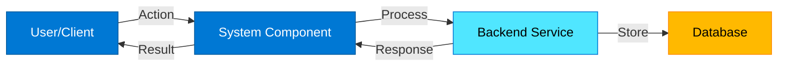
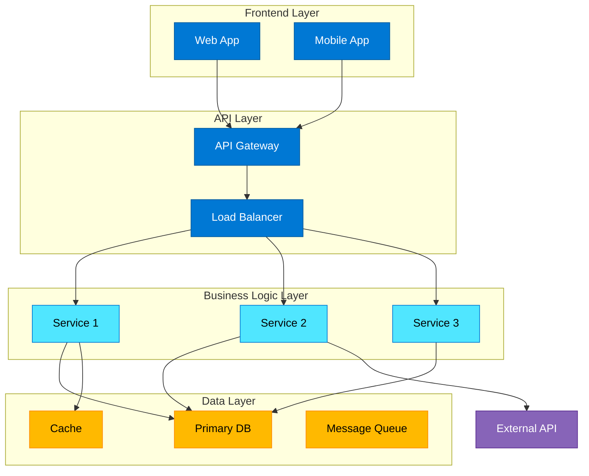
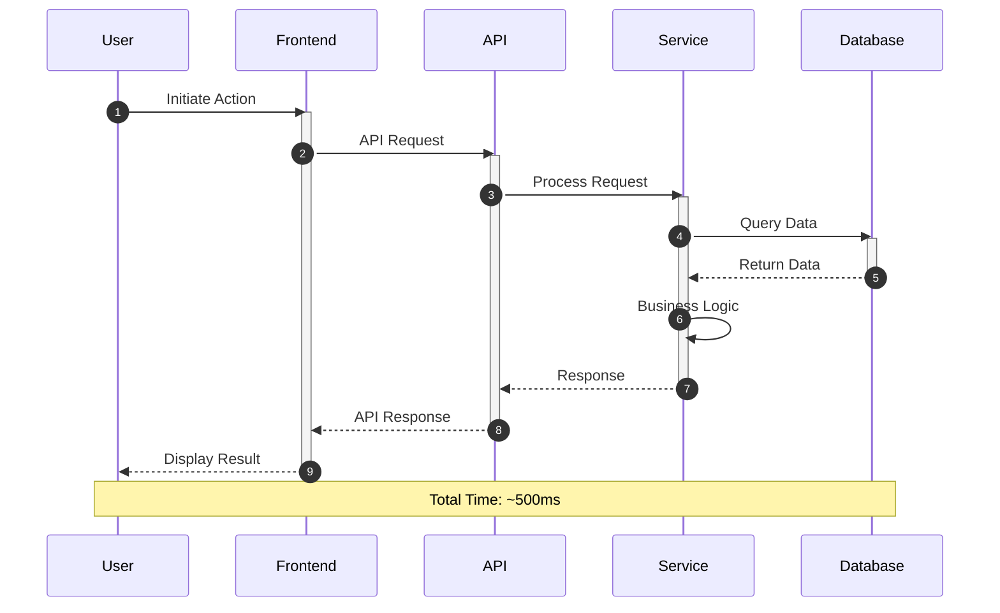
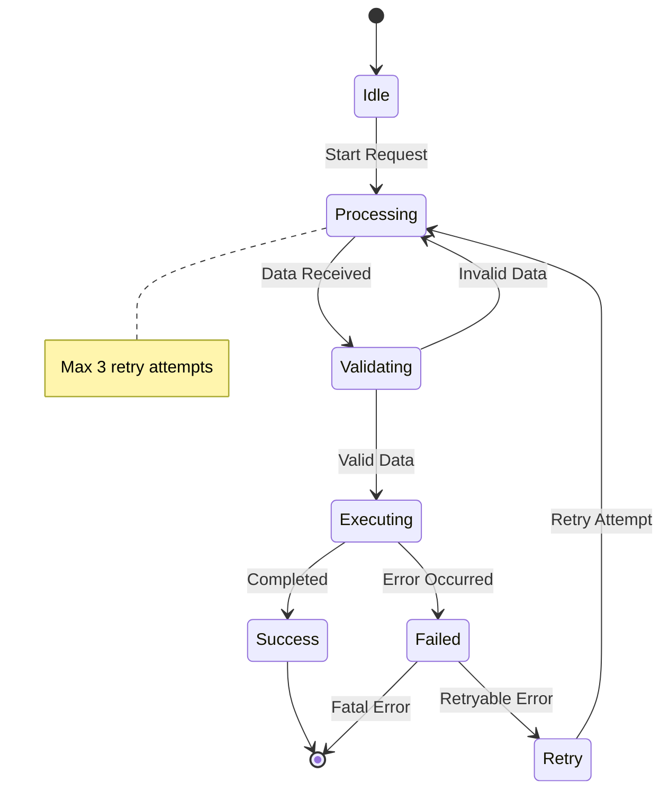
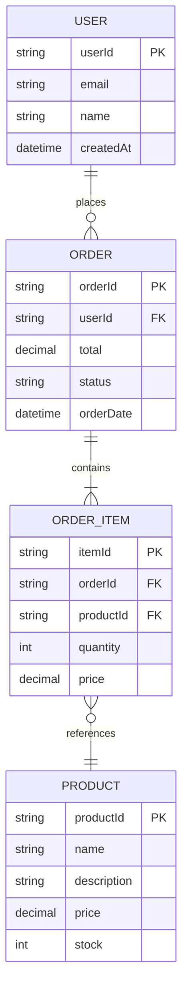
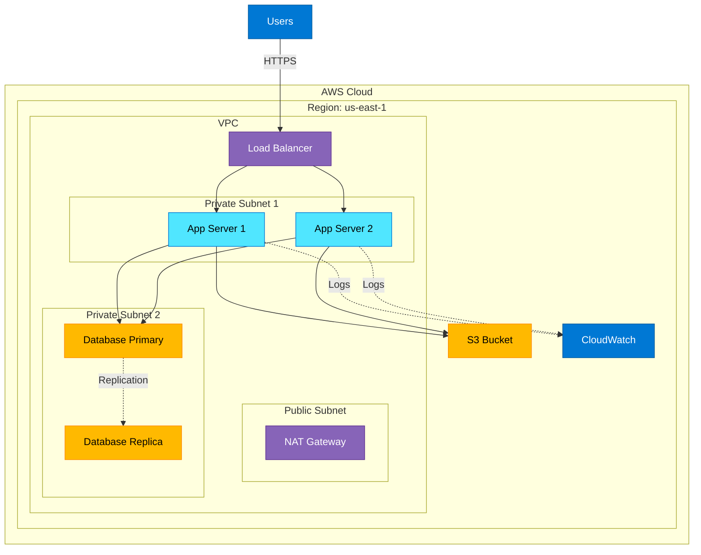
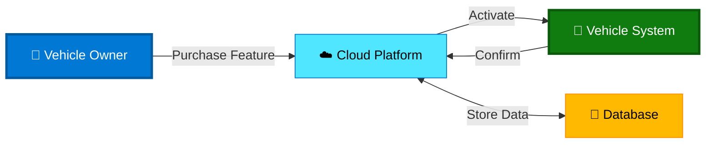
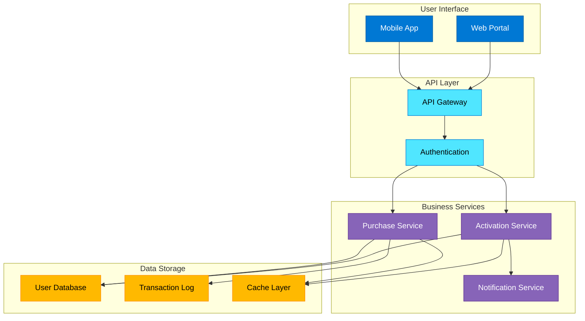

# Design Documentation Standards

## Purpose
This document defines standards for creating professional design documents with clear, accessible diagrams that follow Microsoft's design principles. All design documents should be understandable by both technical and non-technical stakeholders.

## Design Document Structure

Every design document MUST include:
1. **Overview** - Executive summary (2-3 paragraphs)
2. **Architecture Diagrams** - Visual system representation
3. **Component Details** - Detailed component descriptions
4. **Data Models** - Data structures and relationships
5. **Correctness Properties** - Testable system properties
6. **Error Handling** - Error scenarios and recovery
7. **Testing Strategy** - Testing approach and frameworks
8. **Security Considerations** - Security measures
9. **Monitoring** - Observability and metrics
10. **Deployment** - Infrastructure and CI/CD

## Mermaid Diagram Standards

### General Principles

1. **Clarity Over Complexity**: Diagrams should be immediately understandable
2. **Consistent Styling**: Use consistent colors, shapes, and layouts
3. **Proper Labeling**: All nodes and edges must have clear, descriptive labels
4. **Logical Flow**: Information should flow left-to-right or top-to-bottom
5. **Appropriate Detail**: Show enough detail without overwhelming the viewer

### Microsoft-Style Design Guidelines

#### Color Palette (Microsoft-Inspired)
- **Primary Blue**: `#0078D4` - Main components, primary actions
- **Success Green**: `#107C10` - Successful states, confirmations
- **Warning Orange**: `#FF8C00` - Warnings, attention needed
- **Error Red**: `#D13438` - Errors, critical issues
- **Neutral Gray**: `#605E5C` - Supporting elements
- **Light Background**: `#F3F2F1` - Backgrounds, containers

#### Typography
- Use clear, concise labels
- Avoid technical jargon in user-facing diagrams
- Use sentence case for labels
- Keep labels under 4 words when possible

### Diagram Types and Templates

#### 1. High-Level Architecture Diagram

**Purpose**: Show system overview for executives and non-technical stakeholders

**Template**:

**Rules**:
- Maximum 5-7 nodes
- Clear action labels on edges
- Use icons or emojis for user-facing elements
- Group related components visually

#### 2. Component Architecture Diagram

**Purpose**: Show detailed system components and their interactions

**Template**:

**Rules**:
- Use subgraphs to group layers
- Show clear separation of concerns
- Indicate external dependencies
- Use consistent node shapes per layer

#### 3. Sequence Diagram

**Purpose**: Show step-by-step process flow with timing

**Template**:

**Rules**:
- Use `autonumber` for step tracking
- Show activation boxes for processing time
- Include timing notes for performance-critical flows
- Use `Note` for important clarifications
- Keep to 10-15 steps maximum

#### 4. State Diagram

**Purpose**: Show state transitions and lifecycle

**Template**:

**Rules**:
- Show all possible states
- Label transitions with triggers
- Include error states
- Add notes for business rules
- Use clear state names (avoid abbreviations)

#### 5. Entity Relationship Diagram

**Purpose**: Show data models and relationships

**Template**:

**Rules**:
- Show cardinality clearly (||--o{, }o--||, etc.)
- Include primary keys (PK) and foreign keys (FK)
- List key attributes only (not all fields)
- Use consistent naming conventions
- Group related entities visually

#### 6. Deployment Diagram

**Purpose**: Show infrastructure and deployment architecture

**Template**:

**Rules**:
- Show network boundaries (VPC, subnets)
- Indicate security zones (public/private)
- Show redundancy and failover
- Include monitoring components
- Use dotted lines for non-critical paths

### Diagram Best Practices

#### DO:
✅ Use consistent node sizes within the same diagram
✅ Align nodes horizontally or vertically
✅ Use meaningful, business-friendly labels
✅ Include legends when using custom colors
✅ Add notes for complex logic or constraints
✅ Show error paths and edge cases
✅ Use subgraphs to group related components
✅ Include scale indicators (e.g., "handles 1000 req/s")

#### DON'T:
❌ Use technical jargon without explanation
❌ Create diagrams with more than 15 nodes
❌ Cross lines unnecessarily
❌ Use abbreviations without defining them
❌ Mix different diagram types in one diagram
❌ Omit error handling flows
❌ Use colors without meaning
❌ Create diagrams without a clear purpose

### Accessibility Guidelines

1. **Color Blindness**: Don't rely solely on color to convey information
2. **Text Size**: Ensure labels are readable when rendered
3. **Contrast**: Maintain sufficient contrast between text and background
4. **Alternative Text**: Provide text descriptions of diagrams
5. **Simplicity**: One concept per diagram

### Diagram Validation Checklist

Before finalizing any diagram, verify:
- [ ] Purpose is clear from title/context
- [ ] All nodes have descriptive labels
- [ ] All edges have action labels
- [ ] Color scheme is consistent
- [ ] Flow direction is logical
- [ ] No crossing lines (or minimized)
- [ ] Subgraphs are properly labeled
- [ ] Legend included if needed
- [ ] Diagram fits on one screen/page
- [ ] Non-technical stakeholders can understand it

## Example: Complete Architecture Documentation

### System Overview Diagram

### Detailed Component Diagram

## Integration with Kiro Workflow

When creating design documents:
1. Start with high-level architecture for stakeholder review
2. Add detailed component diagrams for technical team
3. Include sequence diagrams for critical flows
4. Add state diagrams for complex state management
5. Include ER diagrams for data models
6. Finish with deployment diagrams for DevOps

## Tools and Resources

### Mermaid Live Editor
- URL: https://mermaid.live
- Use for testing diagrams before adding to documentation

### Color Palette Reference
- Microsoft Design System: https://www.microsoft.com/design/fluent
- Use for consistent color choices

### Diagram Templates
- Keep a library of reusable diagram templates
- Customize for each project while maintaining consistency

## Review Process

Before finalizing design documents:
1. **Technical Review**: Verify accuracy with engineering team
2. **Stakeholder Review**: Ensure non-technical stakeholders understand
3. **Accessibility Check**: Verify diagrams meet accessibility guidelines
4. **Consistency Check**: Ensure all diagrams follow these standards

---

**Remember**: The goal is to communicate clearly, not to impress with complexity. A simple, clear diagram is always better than a complex, confusing one.
