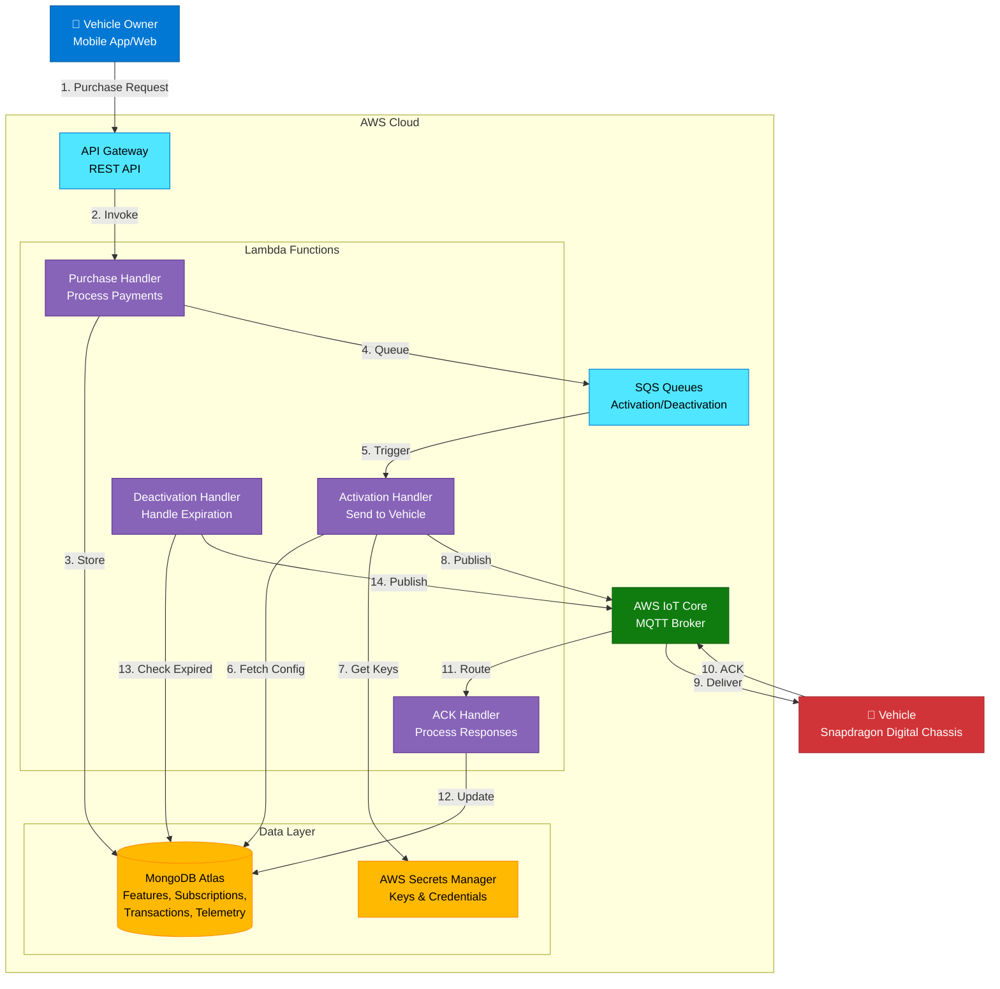
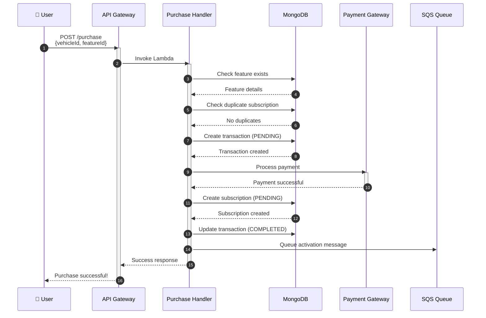
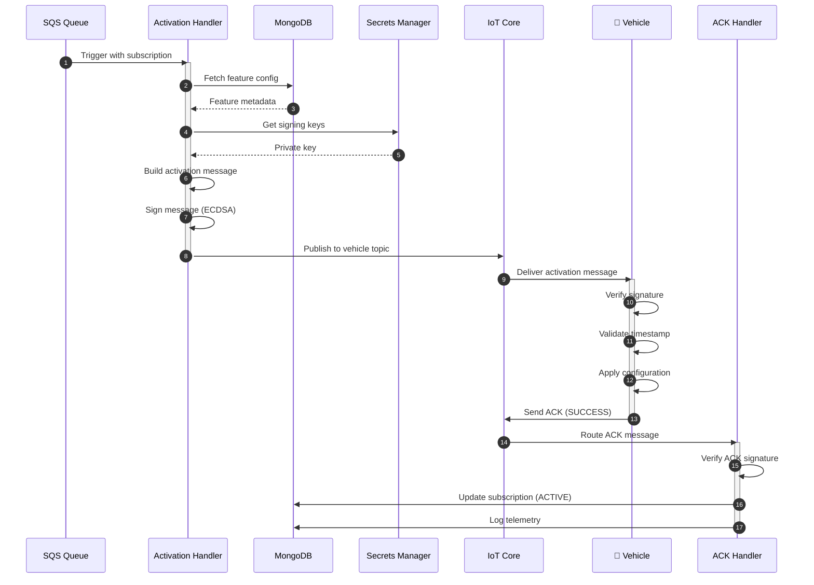
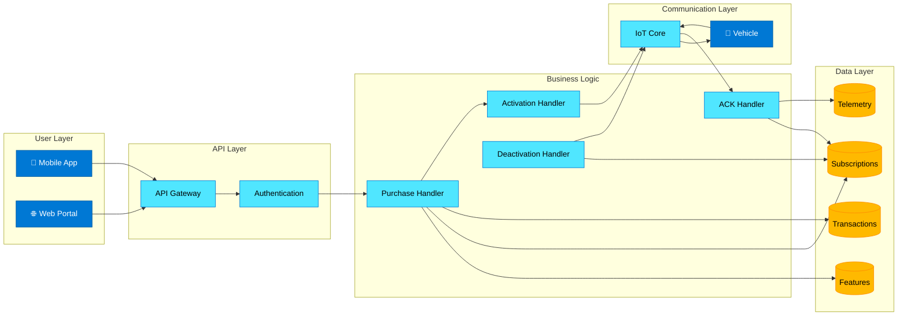
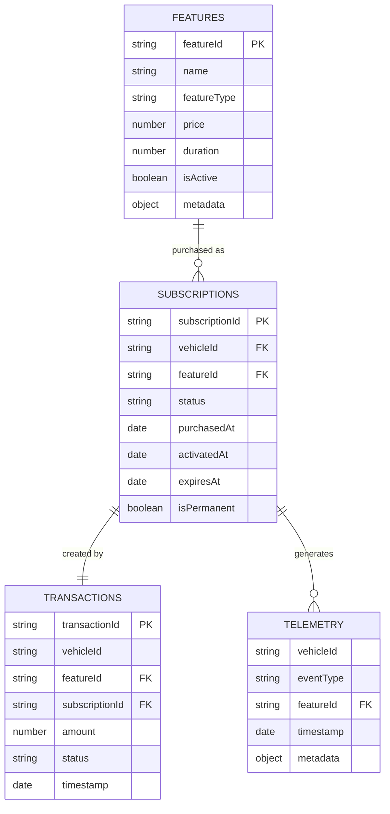
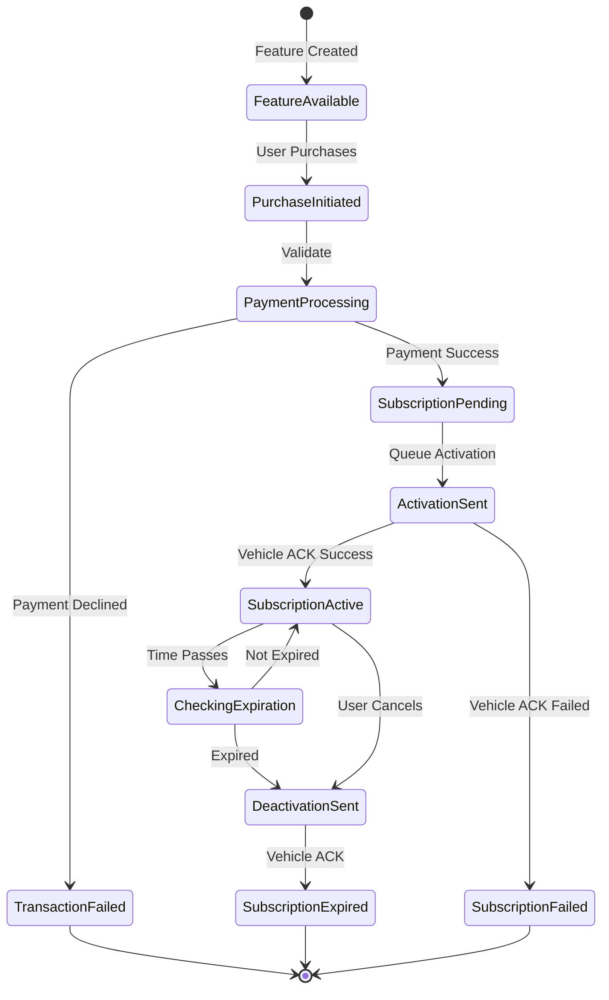
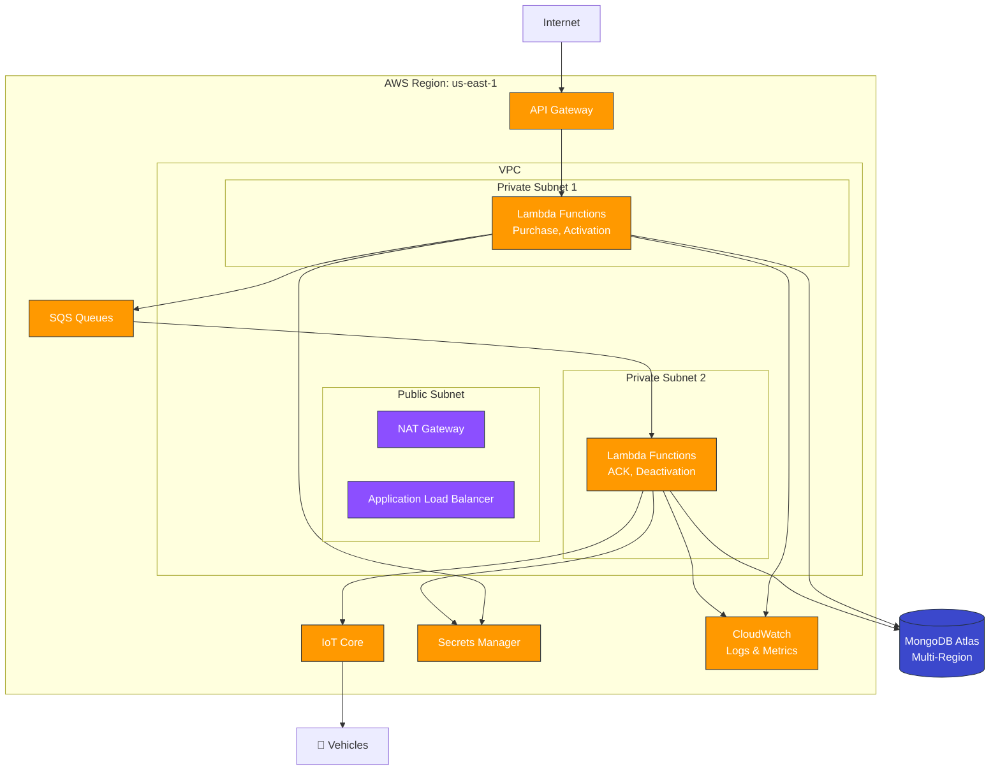
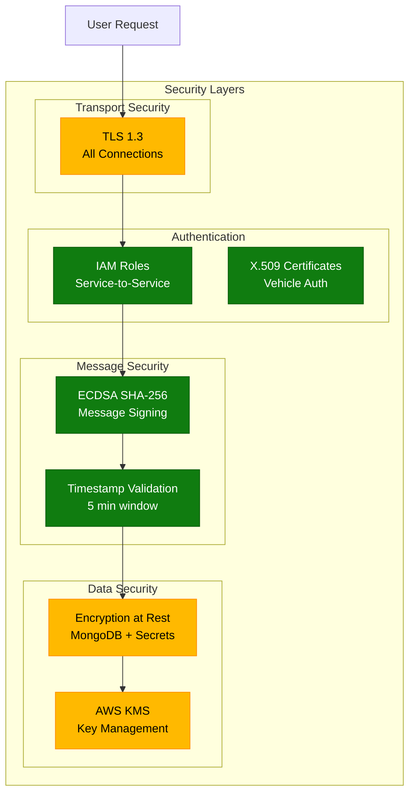
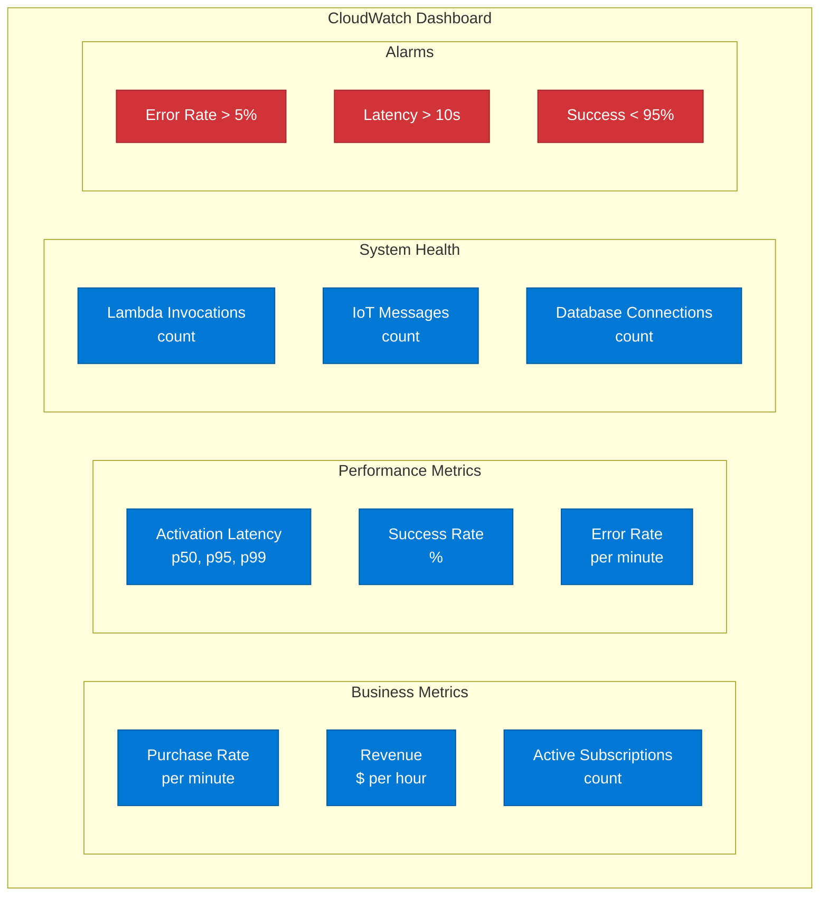
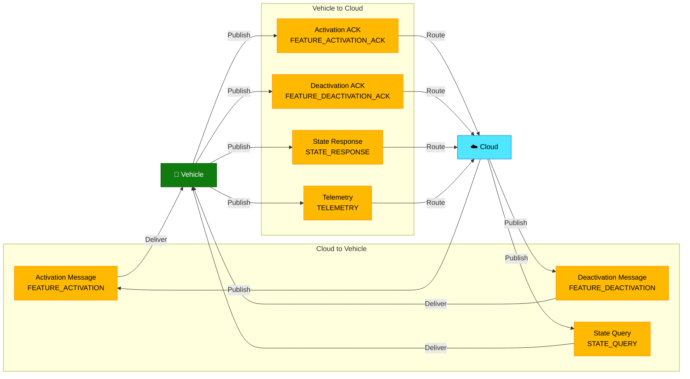

# System Architecture Diagrams

## Complete System Architecture

## Purchase Flow Sequence

## Activation Flow Sequence

## Component Interaction Diagram

## Data Model Relationships

## State Machine Diagram

## Deployment Architecture

## Security Architecture

## Monitoring Dashboard Layout

## Message Flow Diagram

