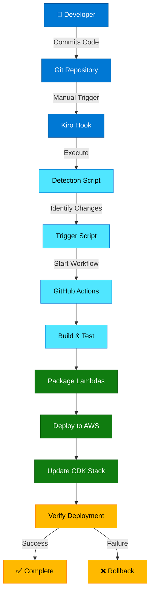

# CI/CD Pipeline Guide for FOD System

## Overview

This guide documents the automated CI/CD pipeline for the Feature on Demand (FOD) system. The pipeline automatically builds, tests, and deploys Lambda functions to AWS when changes are detected in the repository.

## Architecture



## Pipeline Components

### 1. Detection Script (`scripts/detect-lambda-changes.js`)

**Purpose**: Automatically detects which Lambda functions have changed

**Features**:
- Scans `src/lambda/` directory for all Lambda functions
- Compares with git changes (uncommitted, staged, last commit)
- Identifies new Lambda functions automatically
- Generates detailed JSON report

**Usage**:
```bash
node scripts/detect-lambda-changes.js
```

**Output**:
- Console summary with visual indicators (✓ changed, ○ unchanged)
- JSON file: `.lambda-changes.json` with detailed results

### 2. Trigger Script (`scripts/trigger-cicd.js`)

**Purpose**: Triggers GitHub Actions workflow for deployment

**Features**:
- Validates prerequisites (Git, GitHub CLI)
- Checks for uncommitted changes
- Displays pre-deployment summary
- Interactive confirmation prompt
- Triggers GitHub Actions workflow with environment selection

**Usage**:
```bash
# Deploy to dev (default)
node scripts/trigger-cicd.js

# Deploy to specific environment
node scripts/trigger-cicd.js staging
node scripts/trigger-cicd.js prod
```

**Prerequisites**:
- GitHub CLI installed: `winget install GitHub.cli`
- Authenticated with GitHub: `gh auth login`
- All changes committed and pushed

### 3. Kiro Hook (`trigger-cicd-pipeline.kiro.hook`)

**Purpose**: Manual agent hook for triggering CI/CD pipeline

**Trigger**: User-activated from Kiro interface

**Workflow**:
1. Pre-deployment analysis
2. Git status verification
3. Environment selection
4. GitHub Actions trigger
5. Deployment monitoring
6. New Lambda detection
7. Deployment summary

### 4. GitHub Actions Workflow (`.github/workflows/lambda-cicd.yml`)

**Purpose**: Automated build, test, and deployment pipeline

**Trigger**: Manual workflow dispatch with environment input

**Jobs**:

#### Job 1: Detect Changes
- Discovers all Lambda functions in `src/lambda/`
- Identifies changed functions from git diff
- Outputs JSON array of functions to deploy

#### Job 2: Build and Test
- Installs dependencies
- Runs ESLint for code quality
- Executes Jest test suite
- Builds TypeScript to JavaScript
- Uploads build artifacts

#### Job 3: Deploy Lambdas (Matrix Strategy)
- Runs in parallel for each changed Lambda
- Downloads build artifacts
- Configures AWS credentials
- Converts directory name to Lambda function name
- Packages Lambda with dependencies
- Updates Lambda function code in AWS
- Waits for update completion
- Verifies deployment

#### Job 4: Deploy Infrastructure
- Synths CDK stack
- Deploys compute stack with all Lambdas
- Creates new Lambda functions if detected
- Updates existing Lambda configurations

#### Job 5: Post-Deployment Verification
- Checks Lambda function health
- Queries CloudWatch metrics for errors
- Generates deployment summary

## Dynamic Lambda Discovery

### How It Works

The system automatically discovers and deploys Lambda functions:

1. **Directory Scanning**: CDK stack scans `src/lambda/` directory
2. **Entry Point Detection**: Looks for `index.ts` or `index.js`
3. **Automatic Configuration**: Generates Lambda config based on directory name
4. **Naming Convention**: Converts `kebab-case` to `PascalCase`
   - Example: `activation-handler` → `ActivationHandler`

### Adding New Lambda Functions

To add a new Lambda function:

1. Create directory under `src/lambda/`:
   ```
   src/lambda/my-new-handler/
   ```

2. Create entry point:
   ```typescript
   // src/lambda/my-new-handler/index.ts
   import { APIGatewayProxyEvent, APIGatewayProxyResult } from 'aws-lambda';
   
   export async function handler(
     event: APIGatewayProxyEvent
   ): Promise<APIGatewayProxyResult> {
     // Your logic here
     return {
       statusCode: 200,
       body: JSON.stringify({ message: 'Success' })
     };
   }
   ```

3. Commit and trigger pipeline:
   ```bash
   git add src/lambda/my-new-handler/
   git commit -m "Add new Lambda handler"
   git push
   ```

4. Use Kiro hook or trigger script:
   ```bash
   node scripts/trigger-cicd.js dev
   ```

5. Pipeline automatically:
   - Detects new Lambda function
   - Creates Lambda in AWS via CDK
   - Deploys code
   - Sets up permissions and logging

**No manual configuration required!**

## Environment Configuration

### Supported Environments

- **dev**: Development environment for testing
- **staging**: Pre-production environment for validation
- **prod**: Production environment for live traffic

### Lambda Naming Convention

Format: `FOD-{LambdaName}-{Environment}`

Examples:
- `FOD-ActivationHandler-dev`
- `FOD-PurchaseHandler-staging`
- `FOD-CatalogHandler-prod`

### Environment Variables

Common variables (all Lambdas):
```typescript
NODE_ENV: 'production'
AWS_NODEJS_CONNECTION_REUSE_ENABLED: '1'
MONGODB_SECRET_NAME: 'DatabaseStack/mongodb-connection'
MONGODB_URI: process.env.MONGODB_URI
```

Custom variables (per Lambda):
```typescript
// test-activation-handler
HTTP_BRIDGE_URL: process.env.HTTP_BRIDGE_URL
HTTP_BRIDGE_API_KEY: process.env.HTTP_BRIDGE_API_KEY
HTTP_BRIDGE_TIMEOUT: '30000'
```

## Security Standards

All Lambda deployments follow AWS security standards:

### Lambda Configuration
- ✅ Runtime: Node.js 18.x
- ✅ Timeout: 30 seconds (configurable per Lambda)
- ✅ Memory: 512MB minimum
- ✅ Log Retention: 90 days (CloudWatch)
- ✅ Source Maps: Enabled for debugging
- ✅ Minification: Disabled for readability

### Required Secrets (GitHub)
- `AWS_ACCESS_KEY_ID`: AWS credentials for deployment
- `AWS_SECRET_ACCESS_KEY`: AWS secret key
- `AWS_REGION`: Target AWS region (default: us-east-1)

### IAM Permissions Required
```json
{
  "Version": "2012-10-17",
  "Statement": [
    {
      "Effect": "Allow",
      "Action": [
        "lambda:UpdateFunctionCode",
        "lambda:GetFunctionConfiguration",
        "lambda:CreateFunction",
        "lambda:UpdateFunctionConfiguration"
      ],
      "Resource": "arn:aws:lambda:*:*:function:FOD-*"
    },
    {
      "Effect": "Allow",
      "Action": [
        "cloudformation:*",
        "s3:*",
        "iam:PassRole"
      ],
      "Resource": "*"
    }
  ]
}
```

## Monitoring and Verification

### CloudWatch Logs

Each Lambda function logs to CloudWatch:
- Log Group: `/aws/lambda/FOD-{LambdaName}-{Environment}`
- Retention: 90 days
- Log Level: INFO (production), DEBUG (development)

### Metrics to Monitor

1. **Invocations**: Total number of Lambda invocations
2. **Errors**: Failed invocations
3. **Duration**: Execution time
4. **Throttles**: Rate-limited requests
5. **Concurrent Executions**: Simultaneous executions

### Health Check Commands

```bash
# List all FOD Lambda functions
aws lambda list-functions --query "Functions[?starts_with(FunctionName, 'FOD-')]"

# Get specific Lambda configuration
aws lambda get-function-configuration --function-name FOD-ActivationHandler-dev

# View recent logs
aws logs tail /aws/lambda/FOD-ActivationHandler-dev --follow

# Check error metrics
aws cloudwatch get-metric-statistics \
  --namespace AWS/Lambda \
  --metric-name Errors \
  --dimensions Name=FunctionName,Value=FOD-ActivationHandler-dev \
  --start-time $(date -u -d '1 hour ago' +%Y-%m-%dT%H:%M:%S) \
  --end-time $(date -u +%Y-%m-%dT%H:%M:%S) \
  --period 300 \
  --statistics Sum
```

## Troubleshooting

### Common Issues

#### 1. GitHub CLI Not Installed
**Error**: `GitHub CLI (gh) not installed!`

**Solution**:
```bash
winget install GitHub.cli
gh auth login
```

#### 2. Uncommitted Changes
**Error**: `Cannot deploy with uncommitted changes!`

**Solution**:
```bash
git add .
git commit -m "Your commit message"
git push
```

#### 3. Lambda Update Failed
**Error**: `ResourceNotFoundException: Function not found`

**Solution**:
- Lambda doesn't exist yet
- Deploy CDK stack first: `cd infrastructure && cdk deploy FOD-Compute-dev`
- Or let pipeline create it automatically

#### 4. Build Failures
**Error**: TypeScript compilation errors

**Solution**:
```bash
# Run locally to see errors
npm run build
npm run lint
npm run test

# Fix errors and commit
git add .
git commit -m "Fix build errors"
git push
```

#### 5. AWS Credentials Invalid
**Error**: `Unable to locate credentials`

**Solution**:
- Verify GitHub secrets are configured
- Check IAM user has required permissions
- Ensure credentials haven't expired

### Debug Mode

Enable verbose logging in GitHub Actions:
1. Go to repository Settings → Secrets
2. Add secret: `ACTIONS_STEP_DEBUG` = `true`
3. Re-run workflow to see detailed logs

## Best Practices

### Development Workflow

1. **Create Feature Branch**:
   ```bash
   git checkout -b feature/new-lambda-handler
   ```

2. **Develop Locally**:
   ```bash
   npm run build
   npm run test
   npm run lint
   ```

3. **Commit Changes**:
   ```bash
   git add .
   git commit -m "feat: add new Lambda handler"
   git push origin feature/new-lambda-handler
   ```

4. **Deploy to Dev**:
   - Use Kiro hook: "Trigger CI/CD Pipeline"
   - Or run: `node scripts/trigger-cicd.js dev`

5. **Test in Dev Environment**:
   - Verify Lambda in AWS Console
   - Check CloudWatch Logs
   - Test API endpoints

6. **Promote to Staging**:
   ```bash
   git checkout main
   git merge feature/new-lambda-handler
   git push
   node scripts/trigger-cicd.js staging
   ```

7. **Deploy to Production**:
   ```bash
   node scripts/trigger-cicd.js prod
   ```

### Code Quality

- ✅ Write unit tests for all Lambda handlers
- ✅ Follow TypeScript strict mode
- ✅ Use ESLint and Prettier
- ✅ Document complex logic with comments
- ✅ Handle errors gracefully
- ✅ Log important events with context

### Testing Strategy

```typescript
// Example test structure
describe('ActivationHandler', () => {
  it('should activate feature successfully', async () => {
    const event = createMockEvent({ vehicleId: 'VIN123' });
    const result = await handler(event);
    expect(result.statusCode).toBe(200);
  });
  
  it('should handle missing vehicleId', async () => {
    const event = createMockEvent({});
    const result = await handler(event);
    expect(result.statusCode).toBe(400);
  });
});
```

## Performance Optimization

### Lambda Cold Starts

Minimize cold start impact:
- Keep dependencies minimal
- Use Lambda layers for shared code
- Enable provisioned concurrency for critical functions
- Optimize bundle size with tree-shaking

### Deployment Speed

Pipeline optimization:
- Parallel Lambda deployments (matrix strategy)
- Artifact caching between jobs
- Incremental builds (only changed functions)
- Skip unchanged Lambda updates

### Cost Optimization

- Deploy only changed Lambdas (saves time and API calls)
- Use on-demand Lambda pricing
- Set reserved concurrency limits
- Monitor and optimize memory allocation
- Archive old CloudWatch logs to S3

## Rollback Procedures

### Automatic Rollback

If deployment fails:
1. GitHub Actions job fails
2. Lambda code remains at previous version
3. CDK stack update is rolled back automatically

### Manual Rollback

To rollback to previous version:

```bash
# List Lambda versions
aws lambda list-versions-by-function --function-name FOD-ActivationHandler-dev

# Update alias to previous version
aws lambda update-alias \
  --function-name FOD-ActivationHandler-dev \
  --name live \
  --function-version 2

# Or redeploy previous commit
git revert HEAD
git push
node scripts/trigger-cicd.js dev
```

## Continuous Improvement

### Metrics to Track

- Deployment frequency
- Deployment success rate
- Mean time to recovery (MTTR)
- Build duration
- Test coverage percentage

### Future Enhancements

- [ ] Blue-green deployments
- [ ] Canary releases with traffic shifting
- [ ] Automated integration tests
- [ ] Performance regression testing
- [ ] Automated security scanning
- [ ] Multi-region deployments
- [ ] Slack/Teams notifications

## Support and Resources

### Documentation
- [AWS Lambda Best Practices](https://docs.aws.amazon.com/lambda/latest/dg/best-practices.html)
- [GitHub Actions Documentation](https://docs.github.com/en/actions)
- [AWS CDK Documentation](https://docs.aws.amazon.com/cdk/)

### Internal Resources
- Architecture Diagram: `docs/ARCHITECTURE_DIAGRAM.md`
- System Overview: `docs/SYSTEM_OVERVIEW.md`
- Quick Test Guide: `docs/QUICK_TEST_GUIDE.md`

### Getting Help

1. Check CloudWatch Logs for errors
2. Review GitHub Actions workflow logs
3. Consult this guide for troubleshooting
4. Contact DevOps team for infrastructure issues

---

**Last Updated**: December 6, 2024
**Version**: 1.0.0
**Maintained By**: FOD DevOps Team
