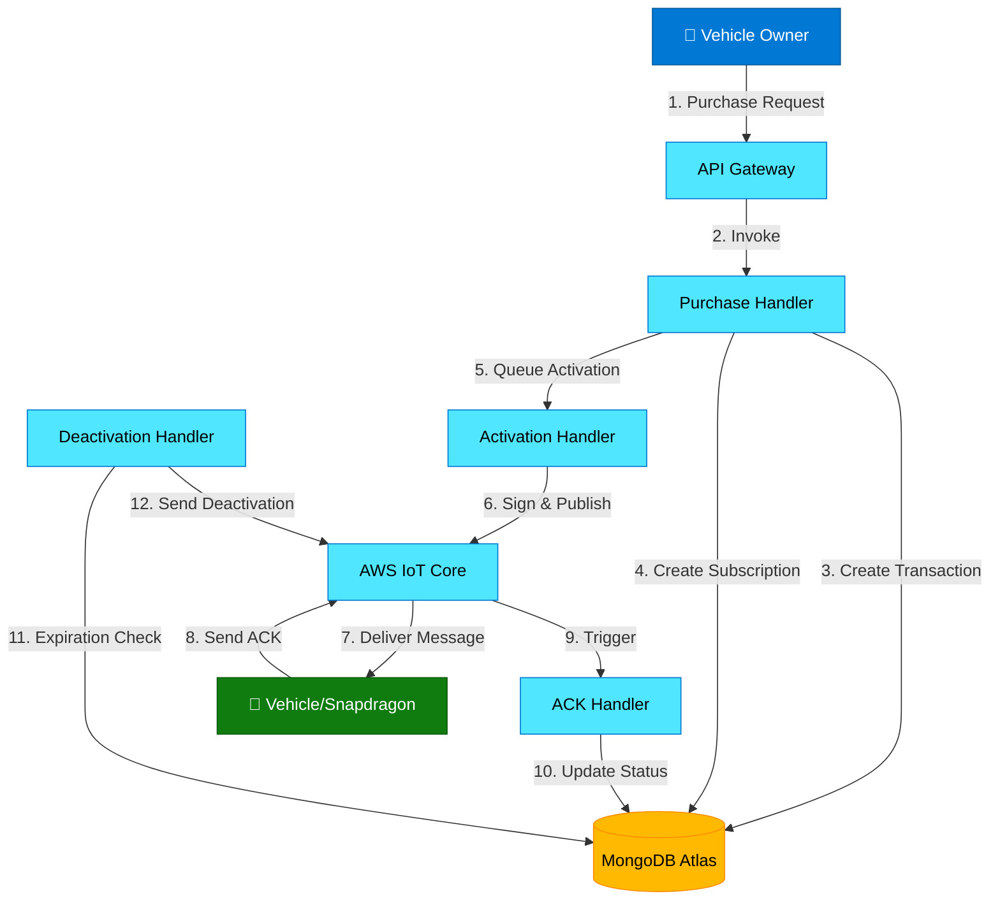
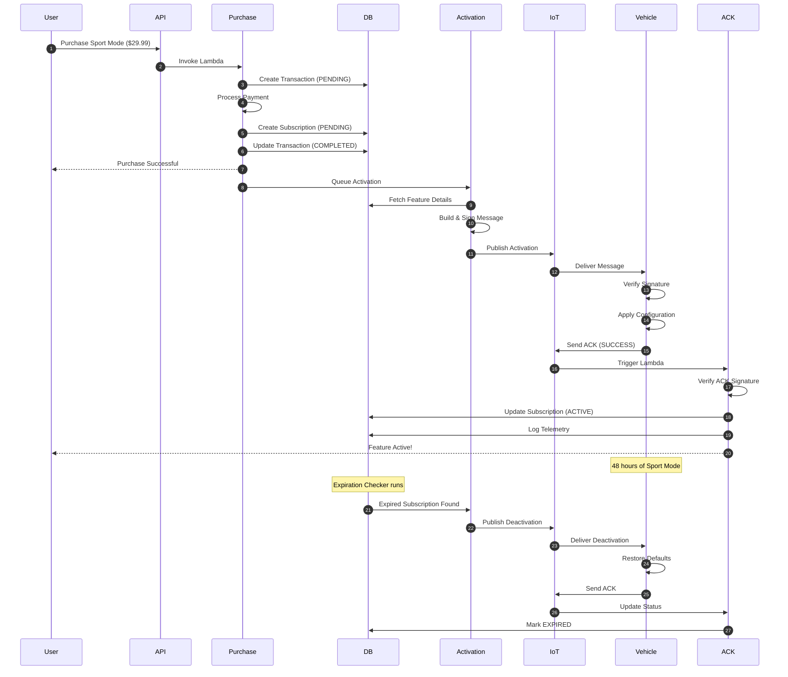

# Snapdragon Feature on Demand (FOD) System - Complete Overview

## System Purpose

The FOD system enables vehicle owners to purchase and activate on-demand features for their Snapdragon Digital Chassis-equipped vehicles. Features can be permanent (like 5G connectivity) or time-limited (like Sport Mode for a weekend).

## Architecture Overview



## Complete User Flow: Weekend Sport Mode Purchase

Let me walk through a real example: **A user purchases "Sport Mode - Weekend Pass" for $29.99**

### Step 1: User Initiates Purchase (Mobile App/Web)

**User Action:**
```
User opens app → Selects "Sport Mode - Weekend Pass" → Clicks "Purchase"
```

**API Request:**
```http
POST https://api.fod-system.com/purchase
Content-Type: application/json

{
  "vehicleId": "VIN1234567890",
  "featureId": "SPORT_MODE_WEEKEND",
  "paymentMethod": "credit_card",
  "paymentToken": "tok_visa_4242"
}
```

### Step 2: Purchase Handler Processes Request

**What Happens:**

1. **Validation**
   - Validates request body
   - Checks if feature exists in catalog
   - Verifies feature is active and available

2. **Duplicate Check**
   ```typescript
   // Check if vehicle already has this feature
   const hasExisting = await subscriptionRepo.hasActiveSubscription(
     "VIN1234567890",
     "SPORT_MODE_WEEKEND"
   );
   // Returns false - user can proceed
   ```

3. **Create Transaction**
   ```typescript
   Transaction {
     transactionId: "txn_abc123",
     vehicleId: "VIN1234567890",
     featureId: "SPORT_MODE_WEEKEND",
     amount: 29.99,
     status: "PENDING",
     timestamp: "2024-12-04T10:00:00Z"
   }
   ```

4. **Process Payment**
   ```typescript
   // Integrates with payment gateway (Stripe/PayPal)
   await processPayment(29.99, "credit_card", "tok_visa_4242");
   // Payment successful!
   ```

5. **Create Subscription**
   ```typescript
   Subscription {
     subscriptionId: "sub_xyz789",
     vehicleId: "VIN1234567890",
     featureId: "SPORT_MODE_WEEKEND",
     status: "PENDING",
     purchasedAt: "2024-12-04T10:00:00Z",
     expiresAt: "2024-12-06T10:00:00Z", // 48 hours later
     isPermanent: false
   }
   ```

6. **Update Transaction**
   ```typescript
   // Link subscription to transaction
   transaction.status = "COMPLETED"
   transaction.subscriptionId = "sub_xyz789"
   ```

**Response to User:**
```json
{
  "success": true,
  "data": {
    "transactionId": "txn_abc123",
    "subscriptionId": "sub_xyz789",
    "vehicleId": "VIN1234567890",
    "featureId": "SPORT_MODE_WEEKEND",
    "amount": 29.99,
    "status": "PENDING",
    "expiresAt": "2024-12-06T10:00:00Z",
    "isPermanent": false
  }
}
```

**User sees:** "Purchase successful! Activating Sport Mode..."

### Step 3: Activation Handler Sends Message to Vehicle

**Triggered by:** SQS queue message from Purchase Handler

**What Happens:**

1. **Fetch Feature Details**
   ```typescript
   Feature {
     featureId: "SPORT_MODE_WEEKEND",
     name: "Sport Mode - Weekend Pass",
     featureType: "PERFORMANCE_MODE",
     metadata: {
       mode: "SPORT",
       throttleResponse: "AGGRESSIVE",
       suspensionStiffness: "FIRM",
       steeringWeight: "HEAVY"
     }
   }
   ```

2. **Build Activation Message**
   ```typescript
   {
     messageId: "msg_def456",
     timestamp: "2024-12-04T10:00:05Z",
     vehicleId: "VIN1234567890",
     messageType: "FEATURE_ACTIVATION",
     payload: {
       featureId: "SPORT_MODE_WEEKEND",
       featureType: "PERFORMANCE_MODE",
       activationConfig: {
         mode: "SPORT",
         parameters: {
           throttleResponse: "AGGRESSIVE",
           suspensionStiffness: "FIRM",
           steeringWeight: "HEAVY"
         }
       },
       expiresAt: "2024-12-06T10:00:00Z",
       isPermanent: false
     },
     signature: "base64-encoded-ecdsa-signature"
   }
   ```

3. **Sign Message**
   ```typescript
   // Uses ECDSA SHA-256 with private key from AWS Secrets Manager
   const signature = await signMessage(message);
   message.signature = signature;
   ```

4. **Publish to IoT Core**
   ```typescript
   // Publishes to topic: vehicle/VIN1234567890/feature/activation
   await iotClient.publish({
     topic: "vehicle/VIN1234567890/feature/activation",
     payload: JSON.stringify(message),
     qos: 1 // At least once delivery
   });
   ```

### Step 4: Vehicle Receives and Processes Message

**Vehicle Side (Snapdragon Digital Chassis):**

1. **Receive Message**
   - Vehicle subscribed to: `vehicle/VIN1234567890/feature/activation`
   - Message arrives via cellular connection (4G/5G)

2. **Verify Signature**
   ```typescript
   // Vehicle has public key stored securely
   const isValid = verifySignature(message, publicKey);
   // Returns true - message is authentic
   ```

3. **Validate Timestamp**
   ```typescript
   // Check message isn't too old (< 5 minutes)
   const isRecent = validateTimestamp(message.timestamp);
   // Returns true - message is fresh
   ```

4. **Apply Configuration**
   ```typescript
   // Vehicle ECU applies sport mode settings
   vehicleController.setThrottleResponse("AGGRESSIVE");
   vehicleController.setSuspensionStiffness("FIRM");
   vehicleController.setSteeringWeight("HEAVY");
   vehicleController.setPerformanceMode("SPORT");
   ```

5. **Update Vehicle State**
   ```typescript
   vehicleState.activeFeatures.push({
     featureId: "SPORT_MODE_WEEKEND",
     activatedAt: "2024-12-04T10:00:10Z",
     expiresAt: "2024-12-06T10:00:00Z"
   });
   vehicleState.performanceMode = "SPORT";
   ```

6. **Send Acknowledgment**
   ```typescript
   {
     messageId: "msg_def456", // Original message ID
     timestamp: "2024-12-04T10:00:12Z",
     vehicleId: "VIN1234567890",
     messageType: "FEATURE_ACTIVATION_ACK",
     payload: {
       featureId: "SPORT_MODE_WEEKEND",
       status: "SUCCESS",
       activatedAt: "2024-12-04T10:00:10Z"
     },
     signature: "vehicle-signed-with-device-key"
   }
   ```

7. **Publish ACK to IoT Core**
   ```typescript
   // Publishes to: vehicle/VIN1234567890/feature/ack
   await iotClient.publish(ackMessage);
   ```

**Driver sees:** Dashboard displays "🏁 Sport Mode Active"

### Step 5: ACK Handler Updates Subscription Status

**Triggered by:** IoT Core rule routes ACK to Lambda

**What Happens:**

1. **Receive ACK Message**
   ```typescript
   // Lambda receives ACK from IoT Core
   const ack = event; // FeatureActivationAckMessage
   ```

2. **Verify ACK Signature**
   ```typescript
   // Verify message came from authentic vehicle
   const isValid = await verifyMessage(ack);
   // Returns true
   ```

3. **Find Subscription**
   ```typescript
   const subscription = await subscriptionRepo.findByVehicleAndFeature(
     "VIN1234567890",
     "SPORT_MODE_WEEKEND"
   );
   // Returns: sub_xyz789
   ```

4. **Update Subscription Status**
   ```typescript
   subscription.status = "ACTIVE";
   subscription.activatedAt = "2024-12-04T10:00:10Z";
   await subscriptionRepo.update(subscription);
   ```

5. **Log Telemetry**
   ```typescript
   await telemetryRepo.logActivation(
     "VIN1234567890",
     "SPORT_MODE_WEEKEND",
     {
       subscriptionId: "sub_xyz789",
       activatedAt: "2024-12-04T10:00:10Z",
       messageId: "msg_def456"
     }
   );
   ```

**User sees:** App updates to "✅ Sport Mode Active - Expires in 48 hours"

### Step 6: User Enjoys Sport Mode (48 hours)

**During Active Period:**

- Vehicle operates in Sport Mode
- Throttle response is aggressive
- Suspension is firmer
- Steering is heavier
- Driver enjoys enhanced performance

**Telemetry Logged:**
```typescript
// Every time driver uses sport mode
{
  vehicleId: "VIN1234567890",
  eventType: "FEATURE_USED",
  featureId: "SPORT_MODE_WEEKEND",
  timestamp: "2024-12-05T15:30:00Z",
  metadata: {
    duration: 3600, // 1 hour session
    averageSpeed: 75,
    maxSpeed: 110
  }
}
```

### Step 7: Feature Expires (48 hours later)

**Expiration Checker Lambda (runs every 5 minutes):**

1. **Find Expired Subscriptions**
   ```typescript
   const expired = await subscriptionRepo.findExpired();
   // Returns: [sub_xyz789] at 2024-12-06T10:00:00Z
   ```

2. **Queue Deactivation**
   ```typescript
   await sqsClient.sendMessage({
     QueueUrl: deactivationQueueUrl,
     MessageBody: JSON.stringify({
       subscriptionId: "sub_xyz789",
       vehicleId: "VIN1234567890",
       featureId: "SPORT_MODE_WEEKEND",
       reason: "EXPIRED"
     })
   });
   ```

### Step 8: Deactivation Handler Processes Expiration

**What Happens:**

1. **Build Deactivation Message**
   ```typescript
   {
     messageId: "msg_ghi789",
     timestamp: "2024-12-06T10:00:05Z",
     vehicleId: "VIN1234567890",
     messageType: "FEATURE_DEACTIVATION",
     payload: {
       featureId: "SPORT_MODE_WEEKEND",
       reason: "EXPIRED",
       restoreConfig: {
         mode: "COMFORT" // Restore to default
       }
     },
     signature: "base64-encoded-signature"
   }
   ```

2. **Publish to IoT Core**
   ```typescript
   // Publishes to: vehicle/VIN1234567890/feature/deactivation
   await iotClient.publish(deactivationMessage);
   ```

3. **Update Subscription**
   ```typescript
   subscription.status = "EXPIRED";
   subscription.deactivatedAt = "2024-12-06T10:00:05Z";
   ```

### Step 9: Vehicle Deactivates Feature

**Vehicle Side:**

1. **Receive Deactivation Message**
2. **Verify Signature**
3. **Restore Default Settings**
   ```typescript
   vehicleController.setPerformanceMode("COMFORT");
   vehicleController.setThrottleResponse("SMOOTH");
   vehicleController.setSuspensionStiffness("NORMAL");
   vehicleController.setSteeringWeight("NORMAL");
   ```

4. **Update State**
   ```typescript
   vehicleState.activeFeatures = vehicleState.activeFeatures.filter(
     f => f.featureId !== "SPORT_MODE_WEEKEND"
   );
   vehicleState.performanceMode = "COMFORT";
   ```

5. **Send ACK**
   ```typescript
   {
     messageType: "FEATURE_DEACTIVATION_ACK",
     payload: {
       featureId: "SPORT_MODE_WEEKEND",
       status: "SUCCESS",
       deactivatedAt: "2024-12-06T10:00:08Z"
     }
   }
   ```

**Driver sees:** Dashboard returns to "Comfort Mode"

**User sees:** App shows "Sport Mode expired. Purchase again?"

## Data Flow Summary



## Database State Throughout Flow

### After Purchase (Step 2)
```javascript
// features collection
{
  featureId: "SPORT_MODE_WEEKEND",
  name: "Sport Mode - Weekend Pass",
  price: 29.99,
  duration: 48,
  isActive: true
}

// transactions collection
{
  transactionId: "txn_abc123",
  vehicleId: "VIN1234567890",
  featureId: "SPORT_MODE_WEEKEND",
  subscriptionId: "sub_xyz789",
  amount: 29.99,
  status: "COMPLETED",
  timestamp: "2024-12-04T10:00:00Z"
}

// subscriptions collection
{
  subscriptionId: "sub_xyz789",
  vehicleId: "VIN1234567890",
  featureId: "SPORT_MODE_WEEKEND",
  status: "PENDING", // ← Waiting for vehicle ACK
  purchasedAt: "2024-12-04T10:00:00Z",
  expiresAt: "2024-12-06T10:00:00Z",
  isPermanent: false
}
```

### After Activation (Step 5)
```javascript
// subscriptions collection
{
  subscriptionId: "sub_xyz789",
  status: "ACTIVE", // ← Updated by ACK Handler
  activatedAt: "2024-12-04T10:00:10Z",
  // ... rest unchanged
}

// telemetry collection
{
  vehicleId: "VIN1234567890",
  eventType: "FEATURE_ACTIVATED",
  featureId: "SPORT_MODE_WEEKEND",
  timestamp: "2024-12-04T10:00:10Z",
  metadata: {
    subscriptionId: "sub_xyz789",
    messageId: "msg_def456"
  }
}
```

### After Expiration (Step 9)
```javascript
// subscriptions collection
{
  subscriptionId: "sub_xyz789",
  status: "EXPIRED", // ← Updated by Deactivation
  deactivatedAt: "2024-12-06T10:00:08Z",
  // ... rest unchanged
}

// telemetry collection (new entry)
{
  vehicleId: "VIN1234567890",
  eventType: "FEATURE_DEACTIVATED",
  featureId: "SPORT_MODE_WEEKEND",
  timestamp: "2024-12-06T10:00:08Z",
  metadata: {
    reason: "EXPIRED"
  }
}
```

## Security Features

### Message Signing (ECDSA SHA-256)
```typescript
// Cloud signs with private key
const signature = sign(message, privateKey);

// Vehicle verifies with public key
const isValid = verify(message, signature, publicKey);
```

### Timestamp Validation
```typescript
// Reject messages older than 5 minutes
const age = now - messageTimestamp;
if (age > 5 * 60 * 1000) {
  throw new MessageExpiredError();
}
```

### AWS Secrets Manager
- Private keys stored securely
- MongoDB credentials encrypted
- Automatic rotation supported

## Error Handling Examples

### Payment Failure
```typescript
// Purchase Handler
try {
  await processPayment(29.99, "credit_card", token);
} catch (error) {
  await transactionRepo.markFailed(transactionId);
  return {
    statusCode: 402,
    body: JSON.stringify({
      error: {
        code: "PAYMENT_FAILED",
        message: "Payment declined by processor"
      }
    })
  };
}
```

### Vehicle Offline
```typescript
// Activation Handler publishes to IoT
// If vehicle is offline, message is queued
// When vehicle comes online, it receives message
// ACK Handler updates status when ACK received
```

### Duplicate Purchase
```typescript
// Purchase Handler checks before creating
const hasActive = await subscriptionRepo.hasActiveSubscription(
  vehicleId,
  featureId
);

if (hasActive) {
  throw new DuplicateSubscriptionError(vehicleId, featureId);
}
```

## Monitoring & Observability

### CloudWatch Metrics
- `FeatureActivationSuccess` - Count of successful activations
- `FeatureActivationFailure` - Count of failed activations
- `ActivationLatency` - Time from purchase to activation
- `PaymentProcessingTime` - Payment gateway response time

### Telemetry Events
- `FEATURE_ACTIVATED` - Feature successfully activated
- `FEATURE_DEACTIVATED` - Feature deactivated
- `FEATURE_USED` - Feature usage logged
- `ERROR` - Error occurred
- `STATE_CHANGE` - Vehicle state changed

### Logs
All Lambda functions log structured JSON:
```json
{
  "level": "INFO",
  "message": "Feature activated successfully",
  "vehicleId": "VIN1234567890",
  "featureId": "SPORT_MODE_WEEKEND",
  "subscriptionId": "sub_xyz789",
  "duration": 145
}
```

## Performance Characteristics

- **Purchase API Response**: < 500ms (p95)
- **Activation Latency**: < 5s from purchase to vehicle (p95)
- **Message Delivery**: At-least-once (QoS 1)
- **Database Queries**: Indexed for < 10ms response
- **Concurrent Activations**: 100+ per second

## Next Steps

To deploy and test this system:

1. **Setup MongoDB Atlas** (see `docs/MONGODB_SETUP.md`)
2. **Deploy AWS Infrastructure** (`cdk deploy --all`)
3. **Configure IoT Certificates** (for vehicle authentication)
4. **Test with Simulator** (use Snapdragon MCP server)
5. **Monitor CloudWatch** (dashboards and alarms)

## Questions?

- Architecture: See `design.md`
- API Reference: See Qualcomm SDK docs
- Deployment: See `MONGODB_SETUP.md`
- Testing: Run `npm test`
